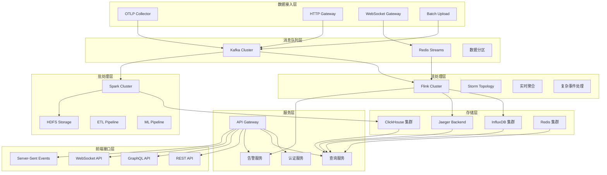

# 后端数据处理基础设施架构文档

**文档版本：** V1.0  
**创建日期：** 2024-08-25  
**文档目标：** 为LLM+MCP可观测性平台提供完整的后端数据处理架构解决方案

---

## 1. 整体架构设计

### 1.1 分层架构图



### 1.2 核心技术选型

| 层级 | 组件 | 技术选型 | 选择理由 | 替代方案 |
|------|------|----------|----------|----------|
| **数据接入** | OTLP收集器 | OpenTelemetry Collector | 标准协议，生态完善 | Jaeger Agent |
| **消息队列** | 高吞吐队列 | Apache Kafka | 高吞吐量，持久化 | Apache Pulsar |
| **流处理** | 实时计算 | Apache Flink | 低延迟，状态管理 | Apache Storm |
| **时序存储** | 指标存储 | InfluxDB | 时序优化，压缩率高 | Prometheus |
| **链路存储** | 追踪存储 | Jaeger + Cassandra | 分布式，高可用 | Zipkin + ElasticSearch |
| **分析存储** | OLAP存储 | ClickHouse | 实时OLAP，高性能 | Apache Druid |
| **缓存层** | 内存缓存 | Redis Cluster | 高性能，丰富数据结构 | Memcached |

---

## 2. 数据接入层设计

### 2.1 OTLP Collector集群配置

```yaml
# config/otel-collector-cluster.yaml
receivers:
  otlp:
    protocols:
      grpc:
        endpoint: 0.0.0.0:4317
        max_recv_msg_size: 4194304  # 4MB
        max_concurrent_streams: 16
      http:
        endpoint: 0.0.0.0:4318
        max_request_body_size: 4194304
        
  prometheus:
    config:
      scrape_configs:
        - job_name: 'digital-employees'
          kubernetes_sd_configs:
            - role: pod
              namespaces:
                names: ['production', 'staging']
          relabel_configs:
            - source_labels: [__meta_kubernetes_pod_annotation_prometheus_io_scrape]
              action: keep
              regex: true

processors:
  # 内存限制处理器
  memory_limiter:
    check_interval: 1s
    limit_mib: 512
    spike_limit_mib: 128
    
  # 批量处理器
  batch:
    timeout: 5s
    send_batch_size: 1024
    send_batch_max_size: 2048
    
  # 资源处理器
  resource:
    attributes:
      - key: service.instance.id
        from_attribute: host.name
        action: insert
      - key: k8s.cluster.name
        value: "production-cluster"
        action: upsert
        
  # 采样处理器
  probabilistic_sampler:
    sampling_percentage: 10.0
    hash_seed: 22
    
  # 属性处理器
  attributes:
    actions:
      - key: sensitive_data
        action: delete
      - key: user.email
        action: hash
        
  # 尾部采样器（根据结果决定是否保留trace）
  tail_sampling:
    decision_wait: 10s
    num_traces: 50000
    expected_new_traces_per_sec: 10
    policies:
      - name: error-traces
        type: status_code
        status_code: {status_codes: [ERROR]}
      - name: slow-traces  
        type: latency
        latency: {threshold_ms: 1000}
      - name: random-sampling
        type: probabilistic
        probabilistic: {sampling_percentage: 1}

exporters:
  # Kafka导出器 - 原始数据
  kafka:
    brokers: ["kafka-1:9092", "kafka-2:9092", "kafka-3:9092"]
    topic: "otel-traces"
    partition_key: "service.name"
    compression: gzip
    max_message_bytes: 1000000
    retry:
      max_retries: 3
      initial_interval: 5s
      max_interval: 30s
      
  # InfluxDB导出器 - 指标数据
  influxdb:
    endpoint: "http://influxdb-cluster:8086"
    org: "observability"
    bucket: "metrics"
    token: "${INFLUXDB_TOKEN}"
    timeout: 10s
    
  # Jaeger导出器 - 链路数据
  jaeger:
    endpoint: "jaeger-collector:14250"
    tls:
      insecure: true
    sending_queue:
      num_consumers: 4
      queue_size: 100
    retry_on_failure:
      enabled: true
      initial_interval: 5s
      max_interval: 30s
      max_elapsed_time: 120s

connectors:
  # Span指标连接器
  spanmetrics:
    histogram_buckets: [100us, 1ms, 2ms, 6ms, 10ms, 100ms, 250ms]
    dimensions:
      - name: http.method
        default: GET
      - name: http.status_code
    metrics_flush_interval: 30s

service:
  pipelines:
    # 链路数据管道
    traces:
      receivers: [otlp]
      processors: [memory_limiter, resource, attributes, tail_sampling, batch]
      exporters: [jaeger, kafka]
      
    # 指标数据管道  
    metrics:
      receivers: [otlp, prometheus]
      processors: [memory_limiter, resource, batch]
      exporters: [influxdb, kafka]
      
    # 从traces生成指标
    metrics/spanmetrics:
      receivers: [spanmetrics]
      processors: [memory_limiter, resource, batch]  
      exporters: [influxdb]
      
  connectors:
    traces: [spanmetrics]
      
  extensions: [health_check, pprof, zpages]
  
  telemetry:
    logs:
      level: "info"
      development: false
    metrics:
      address: 0.0.0.0:8888
      level: detailed
```

### 2.2 HTTP Gateway设计

```typescript
// src/gateway/http-gateway.ts
import express from 'express';
import { createProxyMiddleware } from 'http-proxy-middleware';
import rateLimit from 'express-rate-limit';
import helmet from 'helmet';

export class HTTPDataGateway {
  private app: express.Application;
  private kafkaProducer: KafkaProducer;
  
  constructor() {
    this.app = express();
    this.setupMiddleware();
    this.setupRoutes();
  }
  
  private setupMiddleware(): void {
    // 安全中间件
    this.app.use(helmet());
    
    // 限流中间件
    const limiter = rateLimit({
      windowMs: 60 * 1000, // 1分钟
      max: 1000, // 每分钟最多1000个请求
      message: 'Too many requests from this IP',
      standardHeaders: true,
      legacyHeaders: false,
    });
    this.app.use(limiter);
    
    // 解析JSON
    this.app.use(express.json({ limit: '10mb' }));
    
    // 请求日志
    this.app.use(this.requestLogger);
  }
  
  private setupRoutes(): void {
    // OTLP代理路由
    this.app.use('/v1/traces', 
      createProxyMiddleware({
        target: 'http://otel-collector:4318',
        changeOrigin: true,
        onProxyReq: this.enrichTraceData.bind(this),
      })
    );
    
    // 自定义业务事件接收
    this.app.post('/api/events', this.handleBusinessEvents.bind(this));
    
    // 批量数据上传
    this.app.post('/api/batch', this.handleBatchUpload.bind(this));
    
    // 健康检查
    this.app.get('/health', (req, res) => {
      res.json({ status: 'healthy', timestamp: Date.now() });
    });
  }
  
  private enrichTraceData(proxyReq: any, req: any, res: any): void {
    // 添加额外的元数据
    const enrichedData = {
      ...req.body,
      gateway_metadata: {
        received_at: Date.now(),
        client_ip: req.ip,
        user_agent: req.headers['user-agent'],
        request_id: req.headers['x-request-id'] || generateRequestId(),
      }
    };
    
    // 重写请求体
    const bodyData = JSON.stringify(enrichedData);
    proxyReq.setHeader('Content-Type', 'application/json');
    proxyReq.setHeader('Content-Length', Buffer.byteLength(bodyData));
    proxyReq.write(bodyData);
  }
  
  private async handleBusinessEvents(req: express.Request, res: express.Response): Promise<void> {
    try {
      const events = Array.isArray(req.body) ? req.body : [req.body];
      
      // 验证事件格式
      const validatedEvents = events.map(event => this.validateBusinessEvent(event));
      
      // 发送到Kafka
      await this.kafkaProducer.sendBatch('business-events', validatedEvents);
      
      res.json({ 
        success: true, 
        processed: validatedEvents.length,
        timestamp: Date.now()
      });
      
    } catch (error) {
      console.error('Failed to process business events:', error);
      res.status(500).json({ 
        error: 'Internal server error',
        message: error.message 
      });
    }
  }
  
  private async handleBatchUpload(req: express.Request, res: express.Response): Promise<void> {
    try {
      const { traces, metrics, logs } = req.body;
      const results: any = {};
      
      // 并行处理不同类型的数据
      const promises: Promise<any>[] = [];
      
      if (traces?.length > 0) {
        promises.push(
          this.kafkaProducer.sendBatch('otel-traces', traces)
            .then(result => results.traces = result)
        );
      }
      
      if (metrics?.length > 0) {
        promises.push(
          this.kafkaProducer.sendBatch('otel-metrics', metrics)
            .then(result => results.metrics = result)
        );
      }
      
      if (logs?.length > 0) {
        promises.push(
          this.kafkaProducer.sendBatch('otel-logs', logs)
            .then(result => results.logs = result)
        );
      }
      
      await Promise.all(promises);
      
      res.json({
        success: true,
        results,
        timestamp: Date.now()
      });
      
    } catch (error) {
      console.error('Batch upload failed:', error);
      res.status(500).json({
        error: 'Batch upload failed',
        message: error.message
      });
    }
  }
  
  private validateBusinessEvent(event: any): any {
    // 基础字段验证
    if (!event.eventType || !event.timestamp) {
      throw new Error('Missing required fields: eventType or timestamp');
    }
    
    // 添加服务器端字段
    return {
      ...event,
      server_timestamp: Date.now(),
      gateway_version: '1.0.0',
    };
  }
  
  private requestLogger(req: express.Request, res: express.Response, next: express.NextFunction): void {
    const start = Date.now();
    
    res.on('finish', () => {
      const duration = Date.now() - start;
      console.log(`${req.method} ${req.path} - ${res.statusCode} - ${duration}ms`);
    });
    
    next();
  }
}

function generateRequestId(): string {
  return `req_${Date.now()}_${Math.random().toString(36).slice(2)}`;
}
```

---

## 3. 消息队列层设计

### 3.1 Kafka集群配置

```yaml
# docker/kafka-cluster.yaml
version: '3.8'
services:
  zookeeper:
    image: confluentinc/cp-zookeeper:7.0.0
    environment:
      ZOOKEEPER_CLIENT_PORT: 2181
      ZOOKEEPER_TICK_TIME: 2000
    volumes:
      - zk-data:/var/lib/zookeeper/data
      - zk-logs:/var/lib/zookeeper/log
    deploy:
      replicas: 3
      resources:
        limits:
          memory: 1G
          cpus: '0.5'

  kafka-1:
    image: confluentinc/cp-kafka:7.0.0
    depends_on:
      - zookeeper
    environment:
      KAFKA_BROKER_ID: 1
      KAFKA_ZOOKEEPER_CONNECT: zookeeper:2181
      KAFKA_ADVERTISED_LISTENERS: PLAINTEXT://kafka-1:9092
      KAFKA_OFFSETS_TOPIC_REPLICATION_FACTOR: 3
      KAFKA_TRANSACTION_STATE_LOG_MIN_ISR: 2
      KAFKA_TRANSACTION_STATE_LOG_REPLICATION_FACTOR: 3
      KAFKA_GROUP_INITIAL_REBALANCE_DELAY_MS: 0
      KAFKA_JMX_PORT: 9101
      KAFKA_JMX_OPTS: -Dcom.sun.management.jmxremote -Dcom.sun.management.jmxremote.authenticate=false -Dcom.sun.management.jmxremote.ssl=false -Djava.rmi.server.hostname=kafka-1 -Dcom.sun.management.jmxremote.rmi.port=9101
      # 性能优化配置
      KAFKA_NUM_NETWORK_THREADS: 8
      KAFKA_NUM_IO_THREADS: 16
      KAFKA_SOCKET_SEND_BUFFER_BYTES: 102400
      KAFKA_SOCKET_RECEIVE_BUFFER_BYTES: 102400
      KAFKA_SOCKET_REQUEST_MAX_BYTES: 104857600
      KAFKA_NUM_PARTITIONS: 12
      KAFKA_DEFAULT_REPLICATION_FACTOR: 3
      KAFKA_MIN_INSYNC_REPLICAS: 2
      KAFKA_LOG_RETENTION_HOURS: 168  # 7天
      KAFKA_LOG_SEGMENT_BYTES: 1073741824  # 1GB
      KAFKA_LOG_RETENTION_CHECK_INTERVAL_MS: 300000
      KAFKA_LOG_CLEANUP_POLICY: delete
    volumes:
      - kafka-1-data:/var/lib/kafka/data
    deploy:
      resources:
        limits:
          memory: 4G
          cpus: '2.0'

  kafka-2:
    image: confluentinc/cp-kafka:7.0.0
    depends_on:
      - zookeeper
    environment:
      KAFKA_BROKER_ID: 2
      KAFKA_ZOOKEEPER_CONNECT: zookeeper:2181
      KAFKA_ADVERTISED_LISTENERS: PLAINTEXT://kafka-2:9092
      # ... 其他配置与kafka-1类似

  kafka-3:
    image: confluentinc/cp-kafka:7.0.0
    depends_on:
      - zookeeper  
    environment:
      KAFKA_BROKER_ID: 3
      KAFKA_ZOOKEEPER_CONNECT: zookeeper:2181
      KAFKA_ADVERTISED_LISTENERS: PLAINTEXT://kafka-3:9092
      # ... 其他配置与kafka-1类似

volumes:
  zk-data:
  zk-logs:
  kafka-1-data:
  kafka-2-data:
  kafka-3-data:
```

### 3.2 Topic分区策略

```typescript
// src/kafka/topic-manager.ts
export class KafkaTopicManager {
  private kafkaAdmin: Admin;
  
  constructor(private kafkaClient: Kafka) {
    this.kafkaAdmin = kafkaClient.admin();
  }
  
  async createTopics(): Promise<void> {
    const topics: ITopicConfig[] = [
      // 原始数据Topic
      {
        topic: 'otel-traces',
        numPartitions: 12, // 基于吞吐量设计
        replicationFactor: 3,
        configEntries: [
          { name: 'cleanup.policy', value: 'delete' },
          { name: 'retention.ms', value: '604800000' }, // 7天
          { name: 'segment.ms', value: '86400000' }, // 1天滚动
          { name: 'compression.type', value: 'gzip' },
        ],
      },
      {
        topic: 'otel-metrics',
        numPartitions: 8,
        replicationFactor: 3,
        configEntries: [
          { name: 'cleanup.policy', value: 'delete' },
          { name: 'retention.ms', value: '2592000000' }, // 30天
        ],
      },
      {
        topic: 'business-events',
        numPartitions: 6,
        replicationFactor: 3,
        configEntries: [
          { name: 'cleanup.policy', value: 'delete' },
          { name: 'retention.ms', value: '7776000000' }, // 90天
        ],
      },
      // 处理后数据Topic
      {
        topic: 'processed-metrics',
        numPartitions: 4,
        replicationFactor: 3,
        configEntries: [
          { name: 'cleanup.policy', value: 'compact' }, // 保留最新状态
        ],
      },
      {
        topic: 'alerts',
        numPartitions: 2,
        replicationFactor: 3,
        configEntries: [
          { name: 'retention.ms', value: '86400000' }, // 1天
          { name: 'segment.ms', value: '3600000' }, // 1小时滚动
        ],
      },
    ];
    
    try {
      await this.kafkaAdmin.createTopics({ topics });
      console.log('Topics created successfully');
    } catch (error) {
      console.error('Failed to create topics:', error);
      throw error;
    }
  }
  
  async getTopicMetadata(): Promise<any> {
    try {
      const metadata = await this.kafkaAdmin.fetchTopicMetadata({
        topics: ['otel-traces', 'otel-metrics', 'business-events']
      });
      return metadata;
    } catch (error) {
      console.error('Failed to fetch topic metadata:', error);
      throw error;
    }
  }
}

// 分区键策略
export class PartitionKeyStrategy {
  static getTracePartitionKey(traceData: any): string {
    // 基于service.name进行分区，确保同一服务的trace在同一分区
    return traceData.resource?.attributes?.['service.name'] || 'unknown';
  }
  
  static getMetricPartitionKey(metricData: any): string {
    // 基于metric name + service.name进行分区
    const serviceName = metricData.resource?.attributes?.['service.name'] || 'unknown';
    const metricName = metricData.metrics?.[0]?.name || 'unknown';
    return `${serviceName}-${metricName}`;
  }
  
  static getBusinessEventPartitionKey(eventData: any): string {
    // 基于用户ID进行分区，确保用户相关事件的顺序
    return eventData.userId || eventData.sessionId || 'anonymous';
  }
}
```

### 3.3 Redis Streams配置

```typescript
// src/redis/streams-manager.ts
import Redis from 'ioredis';

export class RedisStreamsManager {
  private redis: Redis.Cluster;
  
  constructor() {
    this.redis = new Redis.Cluster([
      { port: 7000, host: '127.0.0.1' },
      { port: 7001, host: '127.0.0.1' },
      { port: 7002, host: '127.0.0.1' },
    ], {
      redisOptions: {
        maxRetriesPerRequest: 3,
        retryDelayOnFailover: 100,
        lazyConnect: true,
      },
      scaleReads: 'slave',
    });
  }
  
  async createStreams(): Promise<void> {
    const streams = [
      {
        name: 'realtime-metrics',
        maxLen: 10000,
        groups: ['processors', 'alerts']
      },
      {
        name: 'user-sessions', 
        maxLen: 5000,
        groups: ['analytics']
      },
      {
        name: 'system-events',
        maxLen: 1000,
        groups: ['monitoring']
      }
    ];
    
    for (const stream of streams) {
      try {
        // 创建Stream（如果不存在）
        await this.redis.xadd(stream.name, 'MAXLEN', '~', stream.maxLen, '*', 'init', '1');
        
        // 创建Consumer Groups
        for (const group of stream.groups) {
          try {
            await this.redis.xgroup('CREATE', stream.name, group, '$', 'MKSTREAM');
          } catch (error) {
            // 忽略已存在的group错误
            if (!error.message.includes('BUSYGROUP')) {
              throw error;
            }
          }
        }
        
        console.log(`Stream ${stream.name} created with groups:`, stream.groups);
      } catch (error) {
        console.error(`Failed to create stream ${stream.name}:`, error);
      }
    }
  }
  
  async addToStream(streamName: string, data: Record<string, any>): Promise<string> {
    try {
      const fields: string[] = [];
      Object.entries(data).forEach(([key, value]) => {
        fields.push(key, JSON.stringify(value));
      });
      
      const messageId = await this.redis.xadd(
        streamName,
        'MAXLEN', '~', '10000', // 限制stream长度
        '*', // 自动生成ID
        ...fields
      );
      
      return messageId;
    } catch (error) {
      console.error(`Failed to add to stream ${streamName}:`, error);
      throw error;
    }
  }
  
  async consumeFromStream(
    streamName: string, 
    groupName: string, 
    consumerName: string,
    count: number = 10
  ): Promise<any[]> {
    try {
      const results = await this.redis.xreadgroup(
        'GROUP', groupName, consumerName,
        'COUNT', count,
        'BLOCK', 1000, // 1秒阻塞
        'STREAMS', streamName, '>'
      );
      
      if (!results || results.length === 0) {
        return [];
      }
      
      const messages: any[] = [];
      results[0][1].forEach((message: any) => {
        const [messageId, fields] = message;
        const data: Record<string, any> = {};
        
        for (let i = 0; i < fields.length; i += 2) {
          const key = fields[i];
          const value = fields[i + 1];
          try {
            data[key] = JSON.parse(value);
          } catch {
            data[key] = value;
          }
        }
        
        messages.push({ messageId, data });
      });
      
      return messages;
    } catch (error) {
      console.error(`Failed to consume from stream ${streamName}:`, error);
      throw error;
    }
  }
  
  async acknowledgeMessage(streamName: string, groupName: string, messageId: string): Promise<void> {
    try {
      await this.redis.xack(streamName, groupName, messageId);
    } catch (error) {
      console.error(`Failed to acknowledge message ${messageId}:`, error);
      throw error;
    }
  }
}
```

---

## 4. 流处理层设计

### 4.1 Flink集群配置

```yaml
# k8s/flink-cluster.yaml
apiVersion: apps/v1
kind: Deployment
metadata:
  name: flink-jobmanager
spec:
  replicas: 1
  selector:
    matchLabels:
      app: flink
      component: jobmanager
  template:
    metadata:
      labels:
        app: flink
        component: jobmanager
    spec:
      containers:
      - name: jobmanager
        image: flink:1.17.0-scala_2.12
        args: ["jobmanager"]
        ports:
        - containerPort: 6123
          name: rpc
        - containerPort: 6124
          name: blob-server
        - containerPort: 8081
          name: webui
        env:
        - name: FLINK_PROPERTIES
          value: |
            jobmanager.rpc.address: flink-jobmanager
            taskmanager.numberOfTaskSlots: 4
            parallelism.default: 2
            jobmanager.memory.process.size: 1600m
            taskmanager.memory.process.size: 1728m
            taskmanager.memory.flink.size: 1280m
            # 检查点配置
            execution.checkpointing.interval: 60s
            execution.checkpointing.min-pause: 5s
            execution.checkpointing.timeout: 10m
            execution.checkpointing.max-concurrent-checkpoints: 1
            execution.checkpointing.externalized-checkpoint-retention: RETAIN_ON_CANCELLATION
            # 状态后端配置
            state.backend: rocksdb
            state.checkpoints.dir: file:///opt/flink/checkpoints
            state.savepoints.dir: file:///opt/flink/savepoints
            # Kafka连接器配置
            connector.kafka.commit-on-checkpoints: true
            connector.kafka.enable-idempotent: true
        volumeMounts:
        - name: flink-config
          mountPath: /opt/flink/conf
        - name: checkpoint-storage
          mountPath: /opt/flink/checkpoints
        resources:
          requests:
            memory: "1Gi"
            cpu: "0.5"
          limits:
            memory: "2Gi"
            cpu: "1.0"
      volumes:
      - name: flink-config
        configMap:
          name: flink-config
      - name: checkpoint-storage
        persistentVolumeClaim:
          claimName: flink-checkpoints

---
apiVersion: apps/v1
kind: Deployment
metadata:
  name: flink-taskmanager
spec:
  replicas: 3
  selector:
    matchLabels:
      app: flink
      component: taskmanager
  template:
    metadata:
      labels:
        app: flink
        component: taskmanager
    spec:
      containers:
      - name: taskmanager
        image: flink:1.17.0-scala_2.12
        args: ["taskmanager"]
        ports:
        - containerPort: 6122
          name: rpc
        - containerPort: 6125
          name: query-state
        env:
        - name: FLINK_PROPERTIES
          value: |
            jobmanager.rpc.address: flink-jobmanager
            taskmanager.rpc.port: 6122
            taskmanager.numberOfTaskSlots: 4
            parallelism.default: 2
            taskmanager.memory.process.size: 1728m
            taskmanager.memory.flink.size: 1280m
        resources:
          requests:
            memory: "1.5Gi"
            cpu: "1.0"
          limits:
            memory: "2Gi"
            cpu: "2.0"
```

### 4.2 实时指标聚合作业

```java
// src/main/java/flink/MetricsAggregationJob.java
public class MetricsAggregationJob {
    
    public static void main(String[] args) throws Exception {
        StreamExecutionEnvironment env = StreamExecutionEnvironment.getExecutionEnvironment();
        
        // 配置检查点
        env.enableCheckpointing(60000); // 1分钟
        env.getCheckpointConfig().setCheckpointingMode(CheckpointingMode.EXACTLY_ONCE);
        env.getCheckpointConfig().setMinPauseBetweenCheckpoints(5000);
        
        // Kafka消费配置
        Properties kafkaProps = new Properties();
        kafkaProps.setProperty("bootstrap.servers", "kafka-cluster:9092");
        kafkaProps.setProperty("group.id", "metrics-aggregation");
        
        // 消费原始指标数据
        FlinkKafkaConsumer<String> kafkaSource = new FlinkKafkaConsumer<>(
            "otel-metrics", 
            new SimpleStringSchema(), 
            kafkaProps
        );
        kafkaSource.setStartFromLatest();
        
        DataStream<String> rawMetrics = env.addSource(kafkaSource);
        
        // 解析和转换
        DataStream<MetricData> parsedMetrics = rawMetrics
            .map(new MetricParseFunction())
            .filter(Objects::nonNull);
        
        // 按服务和指标类型分组
        KeyedStream<MetricData, String> keyedMetrics = parsedMetrics
            .keyBy(metric -> metric.getServiceName() + ":" + metric.getMetricName());
        
        // 时间窗口聚合（1分钟窗口，30秒滑动）
        DataStream<AggregatedMetric> aggregatedMetrics = keyedMetrics
            .window(SlidingEventTimeWindows.of(Time.minutes(1), Time.seconds(30)))
            .aggregate(new MetricAggregateFunction(), new MetricWindowFunction());
        
        // 输出到InfluxDB
        aggregatedMetrics.addSink(new InfluxDBSink());
        
        // 异常检测
        DataStream<Alert> alerts = aggregatedMetrics
            .keyBy(AggregatedMetric::getServiceName)
            .flatMap(new AnomalyDetectionFunction());
        
        // 输出告警到Kafka
        alerts.addSink(new FlinkKafkaProducer<>(
            "alerts",
            new AlertSerializationSchema(),
            kafkaProps,
            FlinkKafkaProducer.Semantic.EXACTLY_ONCE
        ));
        
        env.execute("Metrics Aggregation Job");
    }
    
    // 指标聚合函数
    public static class MetricAggregateFunction 
            implements AggregateFunction<MetricData, MetricAccumulator, AggregatedMetric> {
        
        @Override
        public MetricAccumulator createAccumulator() {
            return new MetricAccumulator();
        }
        
        @Override
        public MetricAccumulator add(MetricData metric, MetricAccumulator accumulator) {
            accumulator.add(metric.getValue());
            return accumulator;
        }
        
        @Override
        public AggregatedMetric getResult(MetricAccumulator accumulator) {
            return new AggregatedMetric(
                accumulator.getCount(),
                accumulator.getSum(),
                accumulator.getAvg(),
                accumulator.getMin(),
                accumulator.getMax(),
                accumulator.getPercentile(0.95),
                accumulator.getPercentile(0.99)
            );
        }
        
        @Override
        public MetricAccumulator merge(MetricAccumulator a, MetricAccumulator b) {
            return a.merge(b);
        }
    }
    
    // 异常检测函数
    public static class AnomalyDetectionFunction 
            extends RichFlatMapFunction<AggregatedMetric, Alert> {
        
        private transient ValueState<Double> baselineState;
        private transient ValueState<Double> varianceState;
        
        @Override
        public void open(Configuration parameters) {
            baselineState = getRuntimeContext().getState(
                new ValueStateDescriptor<>("baseline", Double.class)
            );
            varianceState = getRuntimeContext().getState(
                new ValueStateDescriptor<>("variance", Double.class)
            );
        }
        
        @Override
        public void flatMap(AggregatedMetric metric, Collector<Alert> out) throws Exception {
            Double baseline = baselineState.value();
            Double variance = varianceState.value();
            
            if (baseline == null) {
                // 初始化基线
                baselineState.update(metric.getAvg());
                varianceState.update(0.0);
                return;
            }
            
            // 检测异常
            double currentValue = metric.getAvg();
            double threshold = 3.0; // 3倍标准差
            
            if (Math.abs(currentValue - baseline) > threshold * Math.sqrt(variance)) {
                Alert alert = new Alert(
                    metric.getServiceName(),
                    metric.getMetricName(),
                    "ANOMALY_DETECTED",
                    "Value " + currentValue + " deviates from baseline " + baseline,
                    System.currentTimeMillis()
                );
                out.collect(alert);
            }
            
            // 更新基线和方差（指数移动平均）
            double alpha = 0.1;
            double newBaseline = alpha * currentValue + (1 - alpha) * baseline;
            double newVariance = alpha * Math.pow(currentValue - baseline, 2) + (1 - alpha) * variance;
            
            baselineState.update(newBaseline);
            varianceState.update(newVariance);
        }
    }
}
```

### 4.3 复杂事件处理

```java
// src/main/java/flink/ComplexEventProcessingJob.java
public class ComplexEventProcessingJob {
    
    public static void main(String[] args) throws Exception {
        StreamExecutionEnvironment env = StreamExecutionEnvironment.getExecutionEnvironment();
        
        // 创建事件流
        DataStream<BusinessEvent> eventStream = env
            .addSource(new FlinkKafkaConsumer<>("business-events", new BusinessEventSchema(), kafkaProps))
            .assignTimestampsAndWatermarks(
                WatermarkStrategy.<BusinessEvent>forBoundedOutOfOrderness(Duration.ofSeconds(10))
                    .withTimestampAssigner((event, timestamp) -> event.getTimestamp())
            );
        
        // 定义模式：用户会话异常模式
        Pattern<BusinessEvent, ?> sessionAnomalyPattern = Pattern
            .<BusinessEvent>begin("start")
            .where(SimpleCondition.of(event -> "user.session.start".equals(event.getEventType())))
            .next("errors")
            .where(SimpleCondition.of(event -> "system.error".equals(event.getEventType())))
            .timesOrMore(3) // 3次以上错误
            .within(Time.minutes(5)); // 5分钟内
        
        // 应用模式
        PatternStream<BusinessEvent> patternStream = CEP.pattern(
            eventStream.keyBy(BusinessEvent::getUserId), 
            sessionAnomalyPattern
        );
        
        // 处理匹配的模式
        DataStream<Alert> sessionAlerts = patternStream.select(
            new PatternSelectFunction<BusinessEvent, Alert>() {
                @Override
                public Alert select(Map<String, List<BusinessEvent>> pattern) {
                    List<BusinessEvent> errors = pattern.get("errors");
                    BusinessEvent start = pattern.get("start").get(0);
                    
                    return new Alert(
                        "SESSION_ANOMALY",
                        "User " + start.getUserId() + " experienced " + errors.size() + " errors in session",
                        "HIGH",
                        System.currentTimeMillis()
                    );
                }
            }
        );
        
        // 定义模式：LLM调用链异常模式
        Pattern<BusinessEvent, ?> llmChainPattern = Pattern
            .<BusinessEvent>begin("llm_start")
            .where(SimpleCondition.of(event -> "llm.request.start".equals(event.getEventType())))
            .next("tool_calls")
            .where(SimpleCondition.of(event -> "mcp.tool.call".equals(event.getEventType())))
            .oneOrMore()
            .optional()
            .next("llm_error")
            .where(SimpleCondition.of(event -> "llm.request.failed".equals(event.getEventType())))
            .within(Time.seconds(30));
        
        PatternStream<BusinessEvent> llmPatternStream = CEP.pattern(
            eventStream.keyBy(BusinessEvent::getTraceId),
            llmChainPattern
        );
        
        DataStream<Alert> llmAlerts = llmPatternStream.select(
            new PatternSelectFunction<BusinessEvent, Alert>() {
                @Override
                public Alert select(Map<String, List<BusinessEvent>> pattern) {
                    BusinessEvent llmStart = pattern.get("llm_start").get(0);
                    List<BusinessEvent> toolCalls = pattern.get("tool_calls");
                    BusinessEvent llmError = pattern.get("llm_error").get(0);
                    
                    return new Alert(
                        "LLM_CHAIN_FAILURE",
                        "LLM request failed after " + (toolCalls != null ? toolCalls.size() : 0) + " tool calls",
                        "MEDIUM",
                        System.currentTimeMillis()
                    );
                }
            }
        );
        
        // 合并所有告警
        DataStream<Alert> allAlerts = sessionAlerts.union(llmAlerts);
        
        // 告警去重和聚合
        DataStream<Alert> deduplicatedAlerts = allAlerts
            .keyBy(Alert::getAlertType)
            .window(TumblingEventTimeWindows.of(Time.minutes(1)))
            .aggregate(new AlertDeduplicationFunction());
        
        // 输出到告警系统
        deduplicatedAlerts.addSink(new AlertNotificationSink());
        
        env.execute("Complex Event Processing Job");
    }
}
```

---

## 5. 存储层设计

### 5.1 InfluxDB集群配置

```yaml
# docker/influxdb-cluster.yaml
version: '3.8'
services:
  influxdb-1:
    image: influxdb:2.5.0
    environment:
      DOCKER_INFLUXDB_INIT_MODE: setup
      DOCKER_INFLUXDB_INIT_USERNAME: admin
      DOCKER_INFLUXDB_INIT_PASSWORD: password123
      DOCKER_INFLUXDB_INIT_ORG: observability
      DOCKER_INFLUXDB_INIT_BUCKET: metrics
      DOCKER_INFLUXDB_INIT_ADMIN_TOKEN: observability-token-123456
    volumes:
      - influxdb-1-data:/var/lib/influxdb2
      - ./influxdb-config:/etc/influxdb2
    ports:
      - "8086:8086"
    deploy:
      resources:
        limits:
          memory: 4G
          cpus: '2.0'
        reservations:
          memory: 2G
          cpus: '1.0'
    healthcheck:
      test: ["CMD", "influx", "ping"]
      interval: 30s
      timeout: 10s
      retries: 3

  influxdb-2:
    image: influxdb:2.5.0
    environment:
      DOCKER_INFLUXDB_INIT_MODE: setup
      DOCKER_INFLUXDB_INIT_USERNAME: admin
      DOCKER_INFLUXDB_INIT_PASSWORD: password123
      DOCKER_INFLUXDB_INIT_ORG: observability
      DOCKER_INFLUXDB_INIT_BUCKET: metrics
      DOCKER_INFLUXDB_INIT_ADMIN_TOKEN: observability-token-123456
    volumes:
      - influxdb-2-data:/var/lib/influxdb2
    ports:
      - "8087:8086"
    deploy:
      resources:
        limits:
          memory: 4G
          cpus: '2.0'

volumes:
  influxdb-1-data:
  influxdb-2-data:
```

### 5.2 ClickHouse分布式配置

```xml
<!-- config/clickhouse-config.xml -->
<?xml version="1.0"?>
<yandex>
    <listen_host>::</listen_host>
    <http_port>8123</http_port>
    <tcp_port>9000</tcp_port>
    <interserver_http_port>9009</interserver_http_port>
    
    <!-- 集群配置 -->
    <remote_servers>
        <observability_cluster>
            <shard>
                <replica>
                    <host>clickhouse-1</host>
                    <port>9000</port>
                </replica>
                <replica>
                    <host>clickhouse-2</host>
                    <port>9000</port>
                </replica>
            </shard>
            <shard>
                <replica>
                    <host>clickhouse-3</host>
                    <port>9000</port>
                </replica>
                <replica>
                    <host>clickhouse-4</host>
                    <port>9000</port>
                </replica>
            </shard>
        </observability_cluster>
    </remote_servers>
    
    <!-- ZooKeeper配置 -->
    <zookeeper>
        <node>
            <host>zookeeper-1</host>
            <port>2181</port>
        </node>
        <node>
            <host>zookeeper-2</host>
            <port>2181</port>
        </node>
        <node>
            <host>zookeeper-3</host>
            <port>2181</port>
        </node>
    </zookeeper>
    
    <!-- 宏定义 -->
    <macros>
        <shard>01</shard>
        <replica>clickhouse-1</replica>
    </macros>
    
    <!-- 性能配置 -->
    <max_server_memory_usage_to_ram_ratio>0.8</max_server_memory_usage_to_ram_ratio>
    <max_memory_usage>10000000000</max_memory_usage>
    <max_thread_pool_size>10000</max_thread_pool_size>
    <max_concurrent_queries>100</max_concurrent_queries>
    
    <!-- 表引擎配置 -->
    <merge_tree>
        <max_replicated_merges_in_queue>16</max_replicated_merges_in_queue>
        <number_of_free_entries_in_pool_to_lower_max_size_of_merge>8</number_of_free_entries_in_pool_to_lower_max_size_of_merge>
        <max_bytes_to_merge_at_min_space_in_pool>1048576</max_bytes_to_merge_at_min_space_in_pool>
    </merge_tree>
    
    <!-- 日志配置 -->
    <logger>
        <level>information</level>
        <log>/var/log/clickhouse-server/clickhouse-server.log</log>
        <errorlog>/var/log/clickhouse-server/clickhouse-server.err.log</errorlog>
        <size>1000M</size>
        <count>10</count>
    </logger>
</yandex>
```

### 5.3 数据库Schema设计

```sql
-- ClickHouse表结构
-- 链路数据表
CREATE TABLE traces_local ON CLUSTER observability_cluster (
    trace_id String,
    span_id String,
    parent_span_id String,
    service_name String,
    operation_name String,
    start_time DateTime64(9),
    end_time DateTime64(9),
    duration_ns UInt64,
    status_code Int8,
    tags Map(String, String),
    logs Array(Tuple(timestamp DateTime64(9), fields Map(String, String))),
    process Map(String, String),
    created_at DateTime DEFAULT now()
) ENGINE = ReplicatedMergeTree('/clickhouse/tables/{shard}/traces', '{replica}')
PARTITION BY toYYYYMM(start_time)
ORDER BY (service_name, start_time, trace_id, span_id)
TTL created_at + INTERVAL 30 DAY
SETTINGS index_granularity = 8192;

-- 分布式表
CREATE TABLE traces ON CLUSTER observability_cluster AS traces_local
ENGINE = Distributed(observability_cluster, default, traces_local, rand());

-- 业务事件表  
CREATE TABLE business_events_local ON CLUSTER observability_cluster (
    event_id String,
    event_type String,
    user_id String,
    session_id String,
    trace_id String,
    timestamp DateTime64(9),
    properties Map(String, String),
    metrics Map(String, Float64),
    created_at DateTime DEFAULT now()
) ENGINE = ReplicatedMergeTree('/clickhouse/tables/{shard}/business_events', '{replica}')
PARTITION BY toYYYYMM(timestamp)
ORDER BY (event_type, timestamp, user_id, event_id)
TTL created_at + INTERVAL 90 DAY
SETTINGS index_granularity = 8192;

CREATE TABLE business_events ON CLUSTER observability_cluster AS business_events_local
ENGINE = Distributed(observability_cluster, default, business_events_local, sipHash64(user_id));

-- 聚合指标表
CREATE TABLE aggregated_metrics_local ON CLUSTER observability_cluster (
    service_name String,
    metric_name String,
    timestamp DateTime,
    window_size UInt32,
    count UInt64,
    sum Float64,
    avg Float64,
    min Float64,
    max Float64,
    p95 Float64,
    p99 Float64,
    tags Map(String, String),
    created_at DateTime DEFAULT now()
) ENGINE = ReplicatedMergeTree('/clickhouse/tables/{shard}/aggregated_metrics', '{replica}')
PARTITION BY toYYYYMM(timestamp)
ORDER BY (service_name, metric_name, timestamp)
TTL created_at + INTERVAL 180 DAY
SETTINGS index_granularity = 8192;

CREATE TABLE aggregated_metrics ON CLUSTER observability_cluster AS aggregated_metrics_local
ENGINE = Distributed(observability_cluster, default, aggregated_metrics_local, sipHash64(service_name));

-- 物化视图：实时指标汇总
CREATE MATERIALIZED VIEW business_metrics_hourly_mv ON CLUSTER observability_cluster
TO aggregated_metrics_local AS
SELECT
    'business' as service_name,
    event_type as metric_name,
    toStartOfHour(timestamp) as timestamp,
    3600 as window_size,
    count() as count,
    countIf(properties['success'] = 'true') as sum,
    countIf(properties['success'] = 'true') / count() as avg,
    0 as min,
    1 as max,
    0 as p95,
    0 as p99,
    map('event_type', event_type) as tags,
    now() as created_at
FROM business_events_local
WHERE timestamp >= now() - INTERVAL 1 HOUR
GROUP BY event_type, toStartOfHour(timestamp);
```

---

## 6. API服务层设计

### 6.1 查询服务设计

```typescript
// src/services/query-service.ts
import { ClickHouseClient } from '@clickhouse/client';
import { InfluxDB, Point } from '@influxdata/influxdb-client';

export class QueryService {
  private clickhouse: ClickHouseClient;
  private influxDB: InfluxDB;
  
  constructor() {
    this.clickhouse = new ClickHouseClient({
      url: 'http://clickhouse-cluster:8123',
      username: 'default',
      password: '',
      database: 'default',
      clickhouse_settings: {
        async_insert: 1,
        wait_for_async_insert: 0,
      },
    });
    
    this.influxDB = new InfluxDB({
      url: 'http://influxdb-cluster:8086',
      token: 'observability-token-123456',
    });
  }
  
  // 查询链路数据
  async queryTraces(params: TraceQueryParams): Promise<Trace[]> {
    let query = `
      SELECT 
        trace_id,
        span_id,
        parent_span_id,
        service_name,
        operation_name,
        start_time,
        end_time,
        duration_ns,
        status_code,
        tags
      FROM traces
      WHERE 1=1
    `;
    
    const queryParams: any[] = [];
    
    if (params.serviceNames?.length > 0) {
      query += ` AND service_name IN ({serviceNames:Array(String)})`;
      queryParams.push({ serviceNames: params.serviceNames });
    }
    
    if (params.startTime && params.endTime) {
      query += ` AND start_time >= {startTime:DateTime64} AND start_time <= {endTime:DateTime64}`;
      queryParams.push({ 
        startTime: new Date(params.startTime).toISOString(),
        endTime: new Date(params.endTime).toISOString()
      });
    }
    
    if (params.traceId) {
      query += ` AND trace_id = {traceId:String}`;
      queryParams.push({ traceId: params.traceId });
    }
    
    if (params.minDuration) {
      query += ` AND duration_ns >= {minDuration:UInt64}`;
      queryParams.push({ minDuration: params.minDuration * 1000000 }); // ms to ns
    }
    
    query += ` ORDER BY start_time DESC LIMIT {limit:UInt32}`;
    queryParams.push({ limit: params.limit || 100 });
    
    try {
      const result = await this.clickhouse.query({
        query,
        query_params: Object.assign({}, ...queryParams),
      });
      
      const traces = await result.json<Trace[]>();
      return traces;
    } catch (error) {
      console.error('Failed to query traces:', error);
      throw new Error('Trace query failed');
    }
  }
  
  // 查询聚合指标
  async queryMetrics(params: MetricQueryParams): Promise<MetricData[]> {
    const queryApi = this.influxDB.getQueryApi('observability');
    
    let fluxQuery = `
      from(bucket: "metrics")
      |> range(start: ${params.startTime}, stop: ${params.endTime})
    `;
    
    if (params.measurement) {
      fluxQuery += `|> filter(fn: (r) => r["_measurement"] == "${params.measurement}")`;
    }
    
    if (params.serviceNames?.length > 0) {
      const serviceFilter = params.serviceNames.map(name => `r["service_name"] == "${name}"`).join(' or ');
      fluxQuery += `|> filter(fn: (r) => ${serviceFilter})`;
    }
    
    if (params.aggregation) {
      const windowPeriod = params.window || '1m';
      switch (params.aggregation) {
        case 'mean':
          fluxQuery += `|> aggregateWindow(every: ${windowPeriod}, fn: mean)`;
          break;
        case 'sum':
          fluxQuery += `|> aggregateWindow(every: ${windowPeriod}, fn: sum)`;
          break;
        case 'max':
          fluxQuery += `|> aggregateWindow(every: ${windowPeriod}, fn: max)`;
          break;
        case 'min':
          fluxQuery += `|> aggregateWindow(every: ${windowPeriod}, fn: min)`;
          break;
      }
    }
    
    fluxQuery += `|> yield(name: "result")`;
    
    try {
      const metrics: MetricData[] = [];
      
      await queryApi.queryRows(fluxQuery, {
        next: (row, tableMeta) => {
          const metric = tableMeta.toObject(row) as any;
          metrics.push({
            timestamp: new Date(metric._time),
            measurement: metric._measurement,
            field: metric._field,
            value: metric._value,
            tags: {
              service_name: metric.service_name,
              ...Object.keys(metric)
                .filter(key => !key.startsWith('_') && key !== 'service_name')
                .reduce((tags, key) => ({ ...tags, [key]: metric[key] }), {})
            }
          });
        },
        error: (error) => {
          console.error('InfluxDB query error:', error);
        },
        complete: () => {
          console.log('InfluxDB query completed');
        },
      });
      
      return metrics;
    } catch (error) {
      console.error('Failed to query metrics:', error);
      throw new Error('Metrics query failed');
    }
  }
  
  // 查询业务事件
  async queryBusinessEvents(params: BusinessEventQueryParams): Promise<BusinessEvent[]> {
    let query = `
      SELECT 
        event_id,
        event_type,
        user_id,
        session_id,
        trace_id,
        timestamp,
        properties,
        metrics
      FROM business_events
      WHERE 1=1
    `;
    
    const queryParams: any[] = [];
    
    if (params.eventTypes?.length > 0) {
      query += ` AND event_type IN ({eventTypes:Array(String)})`;
      queryParams.push({ eventTypes: params.eventTypes });
    }
    
    if (params.userIds?.length > 0) {
      query += ` AND user_id IN ({userIds:Array(String)})`;
      queryParams.push({ userIds: params.userIds });
    }
    
    if (params.startTime && params.endTime) {
      query += ` AND timestamp >= {startTime:DateTime64} AND timestamp <= {endTime:DateTime64}`;
      queryParams.push({ 
        startTime: new Date(params.startTime).toISOString(),
        endTime: new Date(params.endTime).toISOString()
      });
    }
    
    query += ` ORDER BY timestamp DESC LIMIT {limit:UInt32}`;
    queryParams.push({ limit: params.limit || 1000 });
    
    try {
      const result = await this.clickhouse.query({
        query,
        query_params: Object.assign({}, ...queryParams),
      });
      
      const events = await result.json<BusinessEvent[]>();
      return events;
    } catch (error) {
      console.error('Failed to query business events:', error);
      throw new Error('Business events query failed');
    }
  }
  
  // 执行聚合查询
  async executeAggregationQuery(query: AggregationQuery): Promise<AggregationResult[]> {
    try {
      let sql = '';
      
      switch (query.type) {
        case 'time_series':
          sql = this.buildTimeSeriesQuery(query);
          break;
        case 'group_by':
          sql = this.buildGroupByQuery(query);
          break;
        case 'top_n':
          sql = this.buildTopNQuery(query);
          break;
        default:
          throw new Error('Unsupported query type');
      }
      
      const result = await this.clickhouse.query({ query: sql });
      const data = await result.json<AggregationResult[]>();
      
      return data;
    } catch (error) {
      console.error('Aggregation query failed:', error);
      throw error;
    }
  }
  
  private buildTimeSeriesQuery(query: AggregationQuery): string {
    const interval = query.interval || '1h';
    const timeColumn = query.timeColumn || 'timestamp';
    
    return `
      SELECT 
        toStartOfInterval(${timeColumn}, INTERVAL ${interval}) as time,
        ${query.aggregations.map(agg => `${agg.function}(${agg.field}) as ${agg.alias || agg.field}`).join(', ')}
      FROM ${query.table}
      WHERE ${timeColumn} >= '${query.startTime}' AND ${timeColumn} <= '${query.endTime}'
      ${query.filters ? 'AND ' + query.filters.map(f => `${f.field} ${f.operator} '${f.value}'`).join(' AND ') : ''}
      GROUP BY time
      ORDER BY time
    `;
  }
  
  private buildGroupByQuery(query: AggregationQuery): string {
    return `
      SELECT 
        ${query.groupBy!.join(', ')},
        ${query.aggregations.map(agg => `${agg.function}(${agg.field}) as ${agg.alias || agg.field}`).join(', ')}
      FROM ${query.table}
      WHERE ${query.timeColumn || 'timestamp'} >= '${query.startTime}' AND ${query.timeColumn || 'timestamp'} <= '${query.endTime}'
      ${query.filters ? 'AND ' + query.filters.map(f => `${f.field} ${f.operator} '${f.value}'`).join(' AND ') : ''}
      GROUP BY ${query.groupBy!.join(', ')}
      ORDER BY ${query.orderBy || query.aggregations[0].alias || query.aggregations[0].field} DESC
      LIMIT ${query.limit || 100}
    `;
  }
  
  private buildTopNQuery(query: AggregationQuery): string {
    const metricField = query.aggregations[0];
    return `
      SELECT 
        ${query.groupBy![0]} as dimension,
        ${metricField.function}(${metricField.field}) as value
      FROM ${query.table}
      WHERE ${query.timeColumn || 'timestamp'} >= '${query.startTime}' AND ${query.timeColumn || 'timestamp'} <= '${query.endTime}'
      ${query.filters ? 'AND ' + query.filters.map(f => `${f.field} ${f.operator} '${f.value}'`).join(' AND ') : ''}
      GROUP BY ${query.groupBy![0]}
      ORDER BY value DESC
      LIMIT ${query.limit || 10}
    `;
  }
}

// 类型定义
interface TraceQueryParams {
  serviceNames?: string[];
  startTime?: string;
  endTime?: string;
  traceId?: string;
  minDuration?: number;
  limit?: number;
}

interface MetricQueryParams {
  measurement?: string;
  serviceNames?: string[];
  startTime: string;
  endTime: string;
  aggregation?: 'mean' | 'sum' | 'max' | 'min';
  window?: string;
}

interface BusinessEventQueryParams {
  eventTypes?: string[];
  userIds?: string[];
  startTime?: string;
  endTime?: string;
  limit?: number;
}

interface AggregationQuery {
  type: 'time_series' | 'group_by' | 'top_n';
  table: string;
  startTime: string;
  endTime: string;
  timeColumn?: string;
  interval?: string;
  groupBy?: string[];
  aggregations: {
    function: string;
    field: string;
    alias?: string;
  }[];
  filters?: {
    field: string;
    operator: string;
    value: any;
  }[];
  orderBy?: string;
  limit?: number;
}

interface AggregationResult {
  [key: string]: any;
}
```

---

## 7. 部署与运维

### 7.1 Docker Compose完整部署

```yaml
# docker-compose.yml
version: '3.8'

networks:
  observability:
    driver: bridge

volumes:
  kafka-1-data:
  kafka-2-data:
  kafka-3-data:
  clickhouse-1-data:
  clickhouse-2-data:
  influxdb-data:
  redis-data:

services:
  # Zookeeper
  zookeeper:
    image: confluentinc/cp-zookeeper:7.0.0
    environment:
      ZOOKEEPER_CLIENT_PORT: 2181
      ZOOKEEPER_TICK_TIME: 2000
    volumes:
      - zk-data:/var/lib/zookeeper/data
    networks:
      - observability

  # Kafka Cluster
  kafka-1:
    image: confluentinc/cp-kafka:7.0.0
    depends_on:
      - zookeeper
    environment:
      KAFKA_BROKER_ID: 1
      KAFKA_ZOOKEEPER_CONNECT: zookeeper:2181
      KAFKA_ADVERTISED_LISTENERS: PLAINTEXT://kafka-1:9092
      KAFKA_OFFSETS_TOPIC_REPLICATION_FACTOR: 3
    volumes:
      - kafka-1-data:/var/lib/kafka/data
    networks:
      - observability

  kafka-2:
    image: confluentinc/cp-kafka:7.0.0
    depends_on:
      - zookeeper
    environment:
      KAFKA_BROKER_ID: 2
      KAFKA_ZOOKEEPER_CONNECT: zookeeper:2181
      KAFKA_ADVERTISED_LISTENERS: PLAINTEXT://kafka-2:9092
      KAFKA_OFFSETS_TOPIC_REPLICATION_FACTOR: 3
    volumes:
      - kafka-2-data:/var/lib/kafka/data
    networks:
      - observability

  kafka-3:
    image: confluentinc/cp-kafka:7.0.0
    depends_on:
      - zookeeper
    environment:
      KAFKA_BROKER_ID: 3
      KAFKA_ZOOKEEPER_CONNECT: zookeeper:2181
      KAFKA_ADVERTISED_LISTENERS: PLAINTEXT://kafka-3:9092
      KAFKA_OFFSETS_TOPIC_REPLICATION_FACTOR: 3
    volumes:
      - kafka-3-data:/var/lib/kafka/data
    networks:
      - observability

  # InfluxDB
  influxdb:
    image: influxdb:2.5.0
    environment:
      DOCKER_INFLUXDB_INIT_MODE: setup
      DOCKER_INFLUXDB_INIT_USERNAME: admin
      DOCKER_INFLUXDB_INIT_PASSWORD: password123
      DOCKER_INFLUXDB_INIT_ORG: observability
      DOCKER_INFLUXDB_INIT_BUCKET: metrics
      DOCKER_INFLUXDB_INIT_ADMIN_TOKEN: observability-token-123456
    volumes:
      - influxdb-data:/var/lib/influxdb2
    ports:
      - "8086:8086"
    networks:
      - observability

  # ClickHouse
  clickhouse-1:
    image: clickhouse/clickhouse-server:22.8.0.0
    environment:
      CLICKHOUSE_DB: default
      CLICKHOUSE_USER: default
      CLICKHOUSE_PASSWORD: ""
    volumes:
      - clickhouse-1-data:/var/lib/clickhouse
      - ./config/clickhouse-config.xml:/etc/clickhouse-server/config.xml
    ports:
      - "8123:8123"
      - "9000:9000"
    networks:
      - observability

  clickhouse-2:
    image: clickhouse/clickhouse-server:22.8.0.0
    environment:
      CLICKHOUSE_DB: default
      CLICKHOUSE_USER: default
      CLICKHOUSE_PASSWORD: ""
    volumes:
      - clickhouse-2-data:/var/lib/clickhouse
      - ./config/clickhouse-config.xml:/etc/clickhouse-server/config.xml
    ports:
      - "8124:8123"
      - "9001:9000"
    networks:
      - observability

  # Redis
  redis:
    image: redis:7.0.0-alpine
    volumes:
      - redis-data:/data
    ports:
      - "6379:6379"
    networks:
      - observability

  # OpenTelemetry Collector
  otel-collector:
    image: otel/opentelemetry-collector-contrib:0.60.0
    command: ["--config=/etc/config/otel-collector-config.yaml"]
    volumes:
      - ./config/otel-collector-config.yaml:/etc/config/otel-collector-config.yaml
    ports:
      - "4317:4317"   # OTLP gRPC receiver
      - "4318:4318"   # OTLP HTTP receiver
      - "8889:8889"   # Prometheus metrics
    depends_on:
      - kafka-1
      - kafka-2
      - kafka-3
      - influxdb
    networks:
      - observability

  # Jaeger
  jaeger:
    image: jaegertracing/all-in-one:1.37.0
    ports:
      - "16686:16686"
      - "14250:14250"
    environment:
      COLLECTOR_OTLP_ENABLED: true
    networks:
      - observability

  # Flink JobManager
  flink-jobmanager:
    image: flink:1.17.0-scala_2.12-java11
    ports:
      - "8081:8081"
    command: jobmanager
    environment:
      - |
        FLINK_PROPERTIES=
        jobmanager.rpc.address: flink-jobmanager
        parallelism.default: 2
    volumes:
      - ./flink-jobs:/opt/flink/jobs
    networks:
      - observability

  # Flink TaskManager
  flink-taskmanager:
    image: flink:1.17.0-scala_2.12-java11
    depends_on:
      - flink-jobmanager
    command: taskmanager
    scale: 2
    environment:
      - |
        FLINK_PROPERTIES=
        jobmanager.rpc.address: flink-jobmanager
        taskmanager.numberOfTaskSlots: 2
        parallelism.default: 2
    volumes:
      - ./flink-jobs:/opt/flink/jobs
    networks:
      - observability

  # API Gateway
  api-gateway:
    build:
      context: .
      dockerfile: Dockerfile.gateway
    ports:
      - "8080:8080"
    depends_on:
      - clickhouse-1
      - influxdb
      - redis
    environment:
      CLICKHOUSE_URL: http://clickhouse-1:8123
      INFLUXDB_URL: http://influxdb:8086
      REDIS_URL: redis://redis:6379
    networks:
      - observability
```

### 7.2 Kubernetes Helm Chart

```yaml
# helm/values.yaml
global:
  imageRegistry: ""
  storageClass: "fast-ssd"

kafka:
  enabled: true
  replicaCount: 3
  resources:
    requests:
      memory: "2Gi"
      cpu: "1"
    limits:
      memory: "4Gi"
      cpu: "2"
  persistence:
    enabled: true
    size: "100Gi"
  config:
    numNetworkThreads: 8
    numIoThreads: 16
    socketSendBufferBytes: 102400
    socketReceiveBufferBytes: 102400
    logRetentionHours: 168

clickhouse:
  enabled: true
  cluster:
    enabled: true
    shards: 2
    replicas: 2
  resources:
    requests:
      memory: "4Gi"
      cpu: "2"
    limits:
      memory: "8Gi"
      cpu: "4"
  persistence:
    enabled: true
    size: "500Gi"
  config:
    maxMemoryUsage: "10000000000"
    maxConcurrentQueries: 100

influxdb:
  enabled: true
  resources:
    requests:
      memory: "2Gi"
      cpu: "1"
    limits:
      memory: "4Gi"  
      cpu: "2"
  persistence:
    enabled: true
    size: "200Gi"
  config:
    retention:
      policy: "30d"

flink:
  enabled: true
  jobmanager:
    replicaCount: 1
    resources:
      requests:
        memory: "2Gi"
        cpu: "1"
      limits:
        memory: "4Gi"
        cpu: "2"
  taskmanager:
    replicaCount: 3
    resources:
      requests:
        memory: "4Gi"
        cpu: "2"
      limits:
        memory: "8Gi"
        cpu: "4"

otelCollector:
  enabled: true
  replicaCount: 2
  resources:
    requests:
      memory: "1Gi" 
      cpu: "0.5"
    limits:
      memory: "2Gi"
      cpu: "1"

apiGateway:
  enabled: true
  replicaCount: 3
  resources:
    requests:
      memory: "512Mi"
      cpu: "0.5"
    limits:
      memory: "1Gi"
      cpu: "1"
  service:
    type: LoadBalancer
    port: 80
    targetPort: 8080

monitoring:
  prometheus:
    enabled: true
    retention: "30d"
  grafana:
    enabled: true
    adminPassword: "admin123"
  alertmanager:
    enabled: true
```

---

## 8. 监控与告警

### 8.1 Prometheus监控配置

```yaml
# monitoring/prometheus-config.yaml
global:
  scrape_interval: 15s
  evaluation_interval: 15s

rule_files:
  - "alert-rules.yml"

alerting:
  alertmanagers:
    - static_configs:
        - targets:
          - alertmanager:9093

scrape_configs:
  # Kafka监控
  - job_name: 'kafka'
    static_configs:
      - targets: ['kafka-1:9101', 'kafka-2:9101', 'kafka-3:9101']
    scrape_interval: 30s
    
  # ClickHouse监控
  - job_name: 'clickhouse'
    static_configs:
      - targets: ['clickhouse-1:9363', 'clickhouse-2:9363']
    scrape_interval: 30s
    
  # InfluxDB监控
  - job_name: 'influxdb'
    static_configs:
      - targets: ['influxdb:8086']
    metrics_path: '/metrics'
    scrape_interval: 30s
    
  # Flink监控
  - job_name: 'flink'
    static_configs:
      - targets: ['flink-jobmanager:8081', 'flink-taskmanager:8081']
    metrics_path: '/metrics'
    scrape_interval: 30s
    
  # OTEL Collector监控
  - job_name: 'otel-collector'
    static_configs:
      - targets: ['otel-collector:8889']
    scrape_interval: 15s
    
  # API Gateway监控
  - job_name: 'api-gateway'
    static_configs:
      - targets: ['api-gateway:8080']
    metrics_path: '/metrics'
    scrape_interval: 15s
```

### 8.2 告警规则

```yaml
# monitoring/alert-rules.yml
groups:
- name: infrastructure
  rules:
  
  # Kafka告警
  - alert: KafkaDown
    expr: up{job="kafka"} == 0
    for: 1m
    labels:
      severity: critical
    annotations:
      summary: "Kafka instance is down"
      description: "Kafka instance {{ $labels.instance }} has been down for more than 1 minute"
      
  - alert: KafkaHighLag
    expr: kafka_consumer_lag_sum > 10000
    for: 5m
    labels:
      severity: warning
    annotations:
      summary: "Kafka consumer lag is high"
      description: "Consumer group {{ $labels.consumergroup }} has lag of {{ $value }}"
      
  # ClickHouse告警
  - alert: ClickHouseDown
    expr: up{job="clickhouse"} == 0
    for: 1m
    labels:
      severity: critical
    annotations:
      summary: "ClickHouse instance is down"
      description: "ClickHouse instance {{ $labels.instance }} is not responding"
      
  - alert: ClickHouseSlowQueries
    expr: rate(clickhouse_query_duration_seconds_total[5m]) > 10
    for: 3m
    labels:
      severity: warning
    annotations:
      summary: "ClickHouse has slow queries"
      description: "ClickHouse instance {{ $labels.instance }} has queries slower than 10s"
      
  # Flink告警
  - alert: FlinkJobFailed
    expr: flink_jobmanager_numRunningJobs == 0
    for: 2m
    labels:
      severity: critical
    annotations:
      summary: "Flink job is not running"
      description: "No Flink jobs are currently running"
      
  - alert: FlinkHighBackpressure
    expr: flink_taskmanager_job_task_backPressuredTimeMsPerSecond > 100
    for: 5m
    labels:
      severity: warning
    annotations:
      summary: "Flink job has high backpressure"
      description: "Task {{ $labels.task_name }} has backpressure {{ $value }}ms/s"

- name: data-pipeline
  rules:
  
  # 数据处理告警
  - alert: DataIngestionStopped
    expr: increase(otelcol_receiver_accepted_spans_total[5m]) == 0
    for: 3m
    labels:
      severity: critical
    annotations:
      summary: "Data ingestion has stopped"
      description: "No spans received in the last 5 minutes"
      
  - alert: HighDataProcessingLatency
    expr: histogram_quantile(0.95, rate(flink_taskmanager_job_latency_histogram_bucket[5m])) > 10000
    for: 5m
    labels:
      severity: warning
    annotations:
      summary: "High data processing latency"
      description: "95th percentile latency is {{ $value }}ms"
      
  - alert: StorageSpaceRunningOut
    expr: (clickhouse_table_size_bytes / clickhouse_disk_available_bytes) > 0.8
    for: 10m
    labels:
      severity: warning
    annotations:
      summary: "Storage space running out"
      description: "Disk usage is above 80% on {{ $labels.instance }}"
```

---

此文档提供了完整的后端数据处理基础设施架构设计，涵盖了从数据接入到存储查询的全链路技术方案。架构具有高可用性、高性能和可扩展性的特点，能够支撑大规模的可观测性数据处理需求。

**下一步行动：**
1. 根据实际需求选择合适的组件和部署规模
2. 从简化版本开始，逐步扩展到完整架构
3. 建立完整的监控和告警体系
4. 制定数据保留和清理策略