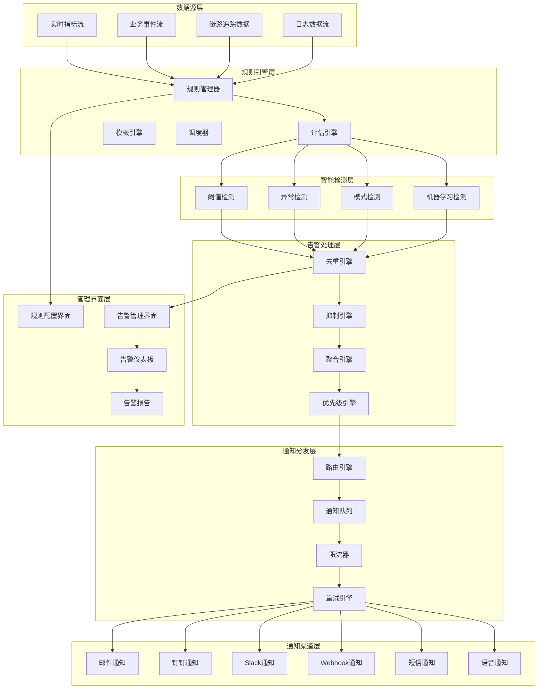

# 告警通知系统设计文档

**文档版本：** V1.0  
**创建日期：** 2024-08-25  
**文档目标：** 为LLM+MCP可观测性平台提供完整的智能告警和多渠道通知解决方案

---

## 1. 系统架构概览

### 1.1 整体架构图



### 1.2 核心组件说明

| 组件 | 职责 | 关键特性 | 技术选型 |
|------|------|----------|----------|
| **规则引擎** | 告警规则管理和评估 | 动态规则、表达式计算、模板渲染 | Node.js + Rule Engine |
| **智能检测** | 多种检测算法 | 阈值、异常、模式、ML检测 | Python + scikit-learn |
| **告警处理** | 去重、抑制、聚合 | 智能降噪、动态聚合 | Redis + 自研算法 |
| **通知分发** | 多渠道消息分发 | 路由、限流、重试、容错 | Message Queue + HTTP |
| **存储层** | 告警历史和配置 | 高可用、快速查询 | PostgreSQL + Redis |

---

## 2. 规则引擎设计

### 2.1 规则定义架构

```typescript
// src/types/alert-rule.ts
export interface AlertRule {
  id: string;
  name: string;
  description: string;
  enabled: boolean;
  priority: 'P0' | 'P1' | 'P2' | 'P3';
  
  // 数据源配置
  dataSource: {
    type: 'metrics' | 'events' | 'traces' | 'logs';
    query: string;
    interval: string; // 评估间隔：1m, 5m, 15m, 1h
    window: string;   // 数据窗口：5m, 10m, 30m, 1h
  };
  
  // 检测条件
  conditions: AlertCondition[];
  
  // 触发设置
  trigger: {
    threshold: number;          // 连续满足次数
    evaluationWindow: string;   // 评估窗口
    recoveryWindow: string;     // 恢复窗口
  };
  
  // 通知配置
  notifications: NotificationConfig[];
  
  // 抑制和去重
  suppression: {
    enabled: boolean;
    conditions: string[];      // 抑制条件
    duration: string;          // 抑制时长
  };
  
  // 标签和分组
  labels: Record<string, string>;
  annotations: Record<string, string>;
  
  // 时间配置
  schedule: {
    timezone: string;
    activeHours?: {
      start: string;
      end: string;
    };
    activeDays?: number[];     // 0-6, 0=Sunday
    holidays?: string[];       // 排除的节假日
  };
  
  // 元数据
  createdBy: string;
  createdAt: Date;
  updatedBy: string;
  updatedAt: Date;
  version: number;
}

export interface AlertCondition {
  id: string;
  type: 'threshold' | 'change' | 'anomaly' | 'pattern' | 'ml';
  operator: 'gt' | 'lt' | 'eq' | 'ne' | 'gte' | 'lte' | 'contains' | 'regex';
  value: number | string;
  
  // 高级配置
  aggregation?: 'avg' | 'sum' | 'max' | 'min' | 'count' | 'p95' | 'p99';
  compareWith?: 'previous' | 'baseline' | 'predicted';
  sensitivity?: 'low' | 'medium' | 'high';
  
  // 条件间逻辑
  logicalOperator?: 'AND' | 'OR';
}

export interface NotificationConfig {
  id: string;
  channel: 'email' | 'dingtalk' | 'slack' | 'webhook' | 'sms' | 'voice';
  targets: string[];         // 接收方列表
  template: string;          // 消息模板
  conditions?: string[];     // 通知条件（可选）
  
  // 通知级别配置
  triggerOn: ('fired' | 'resolved' | 'acknowledged')[];
  
  // 限流配置
  rateLimit: {
    enabled: boolean;
    maxNotifications: number;
    timeWindow: string;
  };
  
  // 升级配置
  escalation?: {
    enabled: boolean;
    delays: string[];        // 升级延时：['5m', '15m', '30m']
    targets: string[][];     // 分级接收方
  };
}
```

### 2.2 规则引擎实现

```typescript
// src/engine/rule-engine.ts
import { EventEmitter } from 'events';
import { CronJob } from 'cron';
import { Expression } from 'expr-eval';

export class AlertRuleEngine extends EventEmitter {
  private rules: Map<string, AlertRule> = new Map();
  private jobs: Map<string, CronJob> = new Map();
  private evaluationHistory: Map<string, EvaluationResult[]> = new Map();
  
  constructor(
    private dataSource: DataSourceManager,
    private detector: DetectionEngine,
    private storage: RuleStorage
  ) {
    super();
  }
  
  async initialize(): Promise<void> {
    // 加载已有规则
    const existingRules = await this.storage.loadRules();
    for (const rule of existingRules) {
      await this.addRule(rule);
    }
    
    console.log(`Loaded ${existingRules.length} alert rules`);
  }
  
  async addRule(rule: AlertRule): Promise<void> {
    // 验证规则
    this.validateRule(rule);
    
    // 存储规则
    this.rules.set(rule.id, rule);
    await this.storage.saveRule(rule);
    
    // 创建调度任务
    const cronPattern = this.intervalToCron(rule.dataSource.interval);
    const job = new CronJob(cronPattern, () => {
      this.evaluateRule(rule.id).catch(error => {
        console.error(`Rule evaluation failed for ${rule.id}:`, error);
      });
    });
    
    job.start();
    this.jobs.set(rule.id, job);
    
    console.log(`Rule ${rule.name} (${rule.id}) added and scheduled`);
  }
  
  async removeRule(ruleId: string): Promise<void> {
    const job = this.jobs.get(ruleId);
    if (job) {
      job.stop();
      this.jobs.delete(ruleId);
    }
    
    this.rules.delete(ruleId);
    this.evaluationHistory.delete(ruleId);
    await this.storage.deleteRule(ruleId);
    
    console.log(`Rule ${ruleId} removed`);
  }
  
  async evaluateRule(ruleId: string): Promise<void> {
    const rule = this.rules.get(ruleId);
    if (!rule || !rule.enabled) {
      return;
    }
    
    try {
      // 检查时间窗口
      if (!this.isInActiveTimeWindow(rule)) {
        return;
      }
      
      // 获取数据
      const data = await this.dataSource.queryData(rule.dataSource);
      
      // 执行检测
      const detectionResults = await Promise.all(
        rule.conditions.map(condition => 
          this.detector.detect(condition, data)
        )
      );
      
      // 评估条件
      const conditionResults = this.evaluateConditions(rule.conditions, detectionResults);
      const isTriggered = this.combineConditions(conditionResults, rule.conditions);
      
      // 记录评估历史
      const evaluationResult: EvaluationResult = {
        ruleId,
        timestamp: new Date(),
        isTriggered,
        conditionResults,
        data: this.sanitizeDataForStorage(data),
      };
      
      this.addEvaluationHistory(ruleId, evaluationResult);
      
      // 检查触发条件
      const shouldAlert = this.shouldTriggerAlert(rule, isTriggered);
      const shouldResolve = this.shouldResolveAlert(rule, isTriggered);
      
      if (shouldAlert) {
        await this.fireAlert(rule, evaluationResult);
      } else if (shouldResolve) {
        await this.resolveAlert(rule, evaluationResult);
      }
      
    } catch (error) {
      console.error(`Rule evaluation error for ${rule.name}:`, error);
      
      // 发送规则执行错误告警
      await this.fireSystemAlert('RULE_EVALUATION_ERROR', {
        ruleId,
        ruleName: rule.name,
        error: error.message,
      });
    }
  }
  
  private validateRule(rule: AlertRule): void {
    if (!rule.id || !rule.name) {
      throw new Error('Rule must have id and name');
    }
    
    if (!rule.dataSource.query) {
      throw new Error('Rule must have a data query');
    }
    
    if (rule.conditions.length === 0) {
      throw new Error('Rule must have at least one condition');
    }
    
    // 验证查询语法
    try {
      this.dataSource.validateQuery(rule.dataSource);
    } catch (error) {
      throw new Error(`Invalid query syntax: ${error.message}`);
    }
  }
  
  private evaluateConditions(
    conditions: AlertCondition[], 
    detectionResults: DetectionResult[]
  ): ConditionResult[] {
    return conditions.map((condition, index) => {
      const detection = detectionResults[index];
      const result = this.evaluateCondition(condition, detection);
      
      return {
        conditionId: condition.id,
        satisfied: result.satisfied,
        value: result.value,
        threshold: condition.value,
        message: result.message,
      };
    });
  }
  
  private evaluateCondition(
    condition: AlertCondition, 
    detection: DetectionResult
  ): { satisfied: boolean; value: any; message: string } {
    const value = detection.value;
    const threshold = condition.value;
    let satisfied = false;
    
    switch (condition.operator) {
      case 'gt':
        satisfied = Number(value) > Number(threshold);
        break;
      case 'lt':
        satisfied = Number(value) < Number(threshold);
        break;
      case 'eq':
        satisfied = value === threshold;
        break;
      case 'ne':
        satisfied = value !== threshold;
        break;
      case 'gte':
        satisfied = Number(value) >= Number(threshold);
        break;
      case 'lte':
        satisfied = Number(value) <= Number(threshold);
        break;
      case 'contains':
        satisfied = String(value).includes(String(threshold));
        break;
      case 'regex':
        satisfied = new RegExp(String(threshold)).test(String(value));
        break;
    }
    
    const message = `${condition.type} detection: value=${value}, threshold=${threshold}, satisfied=${satisfied}`;
    
    return { satisfied, value, message };
  }
  
  private combineConditions(
    results: ConditionResult[], 
    conditions: AlertCondition[]
  ): boolean {
    if (results.length === 0) return false;
    if (results.length === 1) return results[0].satisfied;
    
    // 处理逻辑运算符
    let result = results[0].satisfied;
    
    for (let i = 1; i < results.length; i++) {
      const operator = conditions[i].logicalOperator || 'AND';
      
      if (operator === 'AND') {
        result = result && results[i].satisfied;
      } else if (operator === 'OR') {
        result = result || results[i].satisfied;
      }
    }
    
    return result;
  }
  
  private shouldTriggerAlert(rule: AlertRule, isTriggered: boolean): boolean {
    if (!isTriggered) return false;
    
    const history = this.getRecentEvaluationHistory(rule.id, rule.trigger.threshold);
    
    // 检查连续触发次数
    const recentTriggered = history.filter(h => h.isTriggered).length;
    return recentTriggered >= rule.trigger.threshold;
  }
  
  private shouldResolveAlert(rule: AlertRule, isTriggered: boolean): boolean {
    if (isTriggered) return false;
    
    // 检查是否有活跃告警
    const activeAlert = this.getActiveAlert(rule.id);
    if (!activeAlert) return false;
    
    const history = this.getRecentEvaluationHistory(rule.id, rule.trigger.threshold);
    const recentNotTriggered = history.filter(h => !h.isTriggered).length;
    
    return recentNotTriggered >= rule.trigger.threshold;
  }
  
  private async fireAlert(rule: AlertRule, evaluation: EvaluationResult): Promise<void> {
    const alert: Alert = {
      id: generateAlertId(),
      ruleId: rule.id,
      ruleName: rule.name,
      priority: rule.priority,
      status: 'firing',
      firedAt: new Date(),
      resolvedAt: null,
      labels: rule.labels,
      annotations: rule.annotations,
      evaluation,
    };
    
    // 存储告警
    await this.storage.saveAlert(alert);
    
    // 发送事件
    this.emit('alert:fired', alert, rule);
    
    console.log(`Alert fired: ${rule.name} (${alert.id})`);
  }
  
  private async resolveAlert(rule: AlertRule, evaluation: EvaluationResult): Promise<void> {
    const activeAlert = this.getActiveAlert(rule.id);
    if (!activeAlert) return;
    
    activeAlert.status = 'resolved';
    activeAlert.resolvedAt = new Date();
    
    // 更新存储
    await this.storage.updateAlert(activeAlert);
    
    // 发送事件
    this.emit('alert:resolved', activeAlert, rule);
    
    console.log(`Alert resolved: ${rule.name} (${activeAlert.id})`);
  }
  
  private isInActiveTimeWindow(rule: AlertRule): boolean {
    const now = new Date();
    const schedule = rule.schedule;
    
    if (!schedule) return true;
    
    // 检查工作日
    if (schedule.activeDays && schedule.activeDays.length > 0) {
      const dayOfWeek = now.getDay();
      if (!schedule.activeDays.includes(dayOfWeek)) {
        return false;
      }
    }
    
    // 检查工作时间
    if (schedule.activeHours) {
      const currentTime = now.toTimeString().slice(0, 5);
      if (currentTime < schedule.activeHours.start || currentTime > schedule.activeHours.end) {
        return false;
      }
    }
    
    // 检查节假日
    if (schedule.holidays && schedule.holidays.length > 0) {
      const currentDate = now.toISOString().slice(0, 10);
      if (schedule.holidays.includes(currentDate)) {
        return false;
      }
    }
    
    return true;
  }
  
  private intervalToCron(interval: string): string {
    const intervalMap: Record<string, string> = {
      '1m': '* * * * *',
      '5m': '*/5 * * * *',
      '15m': '*/15 * * * *',
      '30m': '*/30 * * * *',
      '1h': '0 * * * *',
      '6h': '0 */6 * * *',
      '12h': '0 */12 * * *',
      '24h': '0 0 * * *',
    };
    
    return intervalMap[interval] || '*/5 * * * *';
  }
  
  private addEvaluationHistory(ruleId: string, result: EvaluationResult): void {
    let history = this.evaluationHistory.get(ruleId) || [];
    history.push(result);
    
    // 保持最近100条记录
    if (history.length > 100) {
      history = history.slice(-100);
    }
    
    this.evaluationHistory.set(ruleId, history);
  }
  
  private getRecentEvaluationHistory(ruleId: string, count: number): EvaluationResult[] {
    const history = this.evaluationHistory.get(ruleId) || [];
    return history.slice(-count);
  }
  
  private getActiveAlert(ruleId: string): Alert | null {
    // 实际实现中应该从存储中查询
    return null;
  }
  
  private sanitizeDataForStorage(data: any): any {
    // 清理敏感数据，限制大小
    return data;
  }
  
  private async fireSystemAlert(type: string, context: any): Promise<void> {
    // 发送系统级告警
    this.emit('system:alert', { type, context, timestamp: new Date() });
  }
}

// 类型定义
interface DetectionResult {
  value: any;
  confidence: number;
  metadata: Record<string, any>;
}

interface ConditionResult {
  conditionId: string;
  satisfied: boolean;
  value: any;
  threshold: any;
  message: string;
}

interface EvaluationResult {
  ruleId: string;
  timestamp: Date;
  isTriggered: boolean;
  conditionResults: ConditionResult[];
  data: any;
}

interface Alert {
  id: string;
  ruleId: string;
  ruleName: string;
  priority: string;
  status: 'firing' | 'resolved' | 'acknowledged';
  firedAt: Date;
  resolvedAt: Date | null;
  acknowledgedAt?: Date;
  labels: Record<string, string>;
  annotations: Record<string, string>;
  evaluation: EvaluationResult;
}

function generateAlertId(): string {
  return `alert_${Date.now()}_${Math.random().toString(36).slice(2)}`;
}
```

---

## 3. 智能检测引擎

### 3.1 多维度检测算法

```python
# src/detection/detection_engine.py
import numpy as np
import pandas as pd
from typing import Dict, List, Any, Optional
from sklearn.ensemble import IsolationForest
from sklearn.preprocessing import StandardScaler
from scipy import stats
import logging

class DetectionEngine:
    def __init__(self):
        self.logger = logging.getLogger(__name__)
        self.detectors = {
            'threshold': ThresholdDetector(),
            'change': ChangeDetector(), 
            'anomaly': AnomalyDetector(),
            'pattern': PatternDetector(),
            'ml': MLDetector()
        }
        
    async def detect(self, condition: Dict, data: List[Dict]) -> Dict[str, Any]:
        """执行检测算法"""
        detector_type = condition['type']
        detector = self.detectors.get(detector_type)
        
        if not detector:
            raise ValueError(f"Unsupported detector type: {detector_type}")
            
        try:
            result = await detector.detect(condition, data)
            return {
                'value': result.get('value'),
                'confidence': result.get('confidence', 1.0),
                'metadata': result.get('metadata', {}),
                'detector_type': detector_type
            }
        except Exception as e:
            self.logger.error(f"Detection failed for type {detector_type}: {e}")
            raise

class ThresholdDetector:
    """阈值检测器"""
    
    async def detect(self, condition: Dict, data: List[Dict]) -> Dict[str, Any]:
        if not data:
            return {'value': None, 'confidence': 0.0}
            
        # 提取数值
        values = [item.get('value', 0) for item in data]
        
        # 根据聚合方式计算值
        aggregation = condition.get('aggregation', 'avg')
        
        if aggregation == 'avg':
            result_value = np.mean(values)
        elif aggregation == 'sum':
            result_value = np.sum(values)
        elif aggregation == 'max':
            result_value = np.max(values)
        elif aggregation == 'min':
            result_value = np.min(values)
        elif aggregation == 'count':
            result_value = len(values)
        elif aggregation == 'p95':
            result_value = np.percentile(values, 95)
        elif aggregation == 'p99':
            result_value = np.percentile(values, 99)
        else:
            result_value = np.mean(values)
            
        return {
            'value': result_value,
            'confidence': 1.0,
            'metadata': {
                'aggregation': aggregation,
                'data_points': len(values),
                'raw_values': values[-10:] if len(values) > 10 else values  # 保留最近10个值
            }
        }

class ChangeDetector:
    """变化检测器"""
    
    async def detect(self, condition: Dict, data: List[Dict]) -> Dict[str, Any]:
        if len(data) < 2:
            return {'value': 0, 'confidence': 0.0}
            
        values = [item.get('value', 0) for item in data]
        compare_with = condition.get('compareWith', 'previous')
        
        if compare_with == 'previous':
            # 与前一个值比较
            current = values[-1]
            previous = values[-2] if len(values) > 1 else current
            
            if previous == 0:
                change_rate = float('inf') if current != 0 else 0
            else:
                change_rate = (current - previous) / abs(previous) * 100
                
        elif compare_with == 'baseline':
            # 与基线比较（历史平均值）
            current = values[-1]
            baseline = np.mean(values[:-1]) if len(values) > 1 else current
            
            if baseline == 0:
                change_rate = float('inf') if current != 0 else 0
            else:
                change_rate = (current - baseline) / abs(baseline) * 100
                
        else:
            change_rate = 0
            
        return {
            'value': abs(change_rate),
            'confidence': min(1.0, len(values) / 10.0),  # 数据点越多置信度越高
            'metadata': {
                'change_rate': change_rate,
                'direction': 'increase' if change_rate > 0 else 'decrease' if change_rate < 0 else 'stable',
                'compare_with': compare_with,
                'data_points': len(values)
            }
        }

class AnomalyDetector:
    """异常检测器"""
    
    def __init__(self):
        self.isolation_forest = IsolationForest(
            contamination=0.1, 
            random_state=42,
            n_estimators=100
        )
        self.scaler = StandardScaler()
        
    async def detect(self, condition: Dict, data: List[Dict]) -> Dict[str, Any]:
        if len(data) < 10:  # 需要足够的数据点
            return {'value': 0, 'confidence': 0.0}
            
        values = np.array([item.get('value', 0) for item in data]).reshape(-1, 1)
        
        # 标准化数据
        scaled_values = self.scaler.fit_transform(values)
        
        # 使用Isolation Forest检测异常
        anomaly_scores = self.isolation_forest.fit_predict(scaled_values)
        anomaly_probabilities = self.isolation_forest.score_samples(scaled_values)
        
        # 计算最新数据点的异常程度
        latest_score = anomaly_scores[-1]
        latest_prob = anomaly_probabilities[-1]
        
        # 统计学异常检测（Z-score方法）
        z_scores = np.abs(stats.zscore(values.flatten()))
        latest_z_score = z_scores[-1]
        
        # 结合多种方法的结果
        is_anomaly = latest_score == -1 or latest_z_score > 3
        anomaly_strength = max(abs(latest_prob), latest_z_score / 5.0)
        
        return {
            'value': anomaly_strength,
            'confidence': min(1.0, len(data) / 50.0),  # 至少需要50个数据点才有高置信度
            'metadata': {
                'is_anomaly': is_anomaly,
                'isolation_forest_score': float(latest_score),
                'isolation_forest_prob': float(latest_prob),
                'z_score': float(latest_z_score),
                'method': 'isolation_forest+zscore',
                'data_points': len(data)
            }
        }

class PatternDetector:
    """模式检测器"""
    
    async def detect(self, condition: Dict, data: List[Dict]) -> Dict[str, Any]:
        if len(data) < 20:  # 模式检测需要更多数据
            return {'value': 0, 'confidence': 0.0}
            
        values = np.array([item.get('value', 0) for item in data])
        timestamps = [item.get('timestamp') for item in data]
        
        # 趋势检测
        trend_strength = self._detect_trend(values)
        
        # 周期性检测
        periodicity = self._detect_periodicity(values)
        
        # 突发检测
        burst_strength = self._detect_bursts(values)
        
        # 组合分数
        pattern_score = max(abs(trend_strength), periodicity, burst_strength)
        
        return {
            'value': pattern_score,
            'confidence': min(1.0, len(data) / 100.0),
            'metadata': {
                'trend_strength': trend_strength,
                'periodicity': periodicity,
                'burst_strength': burst_strength,
                'dominant_pattern': self._get_dominant_pattern(trend_strength, periodicity, burst_strength),
                'data_points': len(data)
            }
        }
        
    def _detect_trend(self, values: np.ndarray) -> float:
        """检测趋势强度"""
        if len(values) < 3:
            return 0.0
            
        # 使用线性回归检测趋势
        x = np.arange(len(values))
        slope, intercept, r_value, p_value, std_err = stats.linregress(x, values)
        
        # 趋势强度 = 斜率的绝对值 × R²
        trend_strength = abs(slope) * (r_value ** 2) if not np.isnan(r_value) else 0.0
        
        return trend_strength
        
    def _detect_periodicity(self, values: np.ndarray) -> float:
        """检测周期性"""
        if len(values) < 20:
            return 0.0
            
        # 使用FFT检测周期性
        fft = np.fft.fft(values)
        freqs = np.fft.fftfreq(len(values))
        
        # 找到最强的频率分量
        power_spectrum = np.abs(fft[1:len(fft)//2])  # 排除DC分量和负频率
        max_power = np.max(power_spectrum)
        
        # 归一化到0-1范围
        periodicity = max_power / len(values) if len(values) > 0 else 0.0
        
        return min(1.0, periodicity)
        
    def _detect_bursts(self, values: np.ndarray) -> float:
        """检测突发模式"""
        if len(values) < 5:
            return 0.0
            
        # 计算滑动窗口的标准差
        window_size = min(5, len(values) // 4)
        rolling_std = []
        
        for i in range(len(values) - window_size + 1):
            window = values[i:i + window_size]
            rolling_std.append(np.std(window))
            
        if not rolling_std:
            return 0.0
            
        # 突发强度 = 最大标准差 / 平均标准差
        max_std = np.max(rolling_std)
        avg_std = np.mean(rolling_std)
        
        burst_strength = max_std / avg_std if avg_std > 0 else 0.0
        
        return min(1.0, (burst_strength - 1.0) / 5.0) if burst_strength > 1.0 else 0.0
        
    def _get_dominant_pattern(self, trend: float, periodicity: float, burst: float) -> str:
        """确定主导模式"""
        scores = {'trend': trend, 'periodicity': periodicity, 'burst': burst}
        return max(scores, key=scores.get)

class MLDetector:
    """机器学习检测器"""
    
    def __init__(self):
        self.models = {}
        self.feature_scalers = {}
        
    async def detect(self, condition: Dict, data: List[Dict]) -> Dict[str, Any]:
        if len(data) < 50:  # ML需要足够的训练数据
            return {'value': 0, 'confidence': 0.0}
            
        values = np.array([item.get('value', 0) for item in data])
        features = self._extract_features(values)
        
        sensitivity = condition.get('sensitivity', 'medium')
        model_key = f"ml_{condition.get('id', 'default')}_{sensitivity}"
        
        # 训练或更新模型
        if model_key not in self.models:
            self._train_model(model_key, features, sensitivity)
            
        # 预测异常概率
        latest_features = features[-1:] if len(features) > 0 else np.array([[0]])
        anomaly_score = self._predict_anomaly(model_key, latest_features)
        
        return {
            'value': anomaly_score,
            'confidence': min(1.0, len(data) / 200.0),  # ML需要更多数据才有高置信度
            'metadata': {
                'model_key': model_key,
                'sensitivity': sensitivity,
                'features_count': len(features),
                'training_data_size': len(data)
            }
        }
        
    def _extract_features(self, values: np.ndarray) -> np.ndarray:
        """提取特征"""
        if len(values) < 10:
            return np.array([[0]])
            
        features = []
        window_sizes = [5, 10, 20]
        
        for i in range(len(values)):
            feature_row = []
            
            for window_size in window_sizes:
                start_idx = max(0, i - window_size + 1)
                window = values[start_idx:i + 1]
                
                if len(window) > 0:
                    # 统计特征
                    feature_row.extend([
                        np.mean(window),
                        np.std(window),
                        np.min(window),
                        np.max(window),
                        window[-1] if len(window) > 0 else 0,  # 当前值
                    ])
                else:
                    feature_row.extend([0, 0, 0, 0, 0])
                    
            features.append(feature_row)
            
        return np.array(features)
        
    def _train_model(self, model_key: str, features: np.ndarray, sensitivity: str) -> None:
        """训练模型"""
        if len(features) < 10:
            return
            
        # 根据敏感度设置参数
        contamination_map = {
            'low': 0.05,
            'medium': 0.1, 
            'high': 0.2
        }
        
        contamination = contamination_map.get(sensitivity, 0.1)
        
        # 创建和训练模型
        model = IsolationForest(
            contamination=contamination,
            random_state=42,
            n_estimators=100
        )
        
        scaler = StandardScaler()
        scaled_features = scaler.fit_transform(features)
        
        model.fit(scaled_features)
        
        self.models[model_key] = model
        self.feature_scalers[model_key] = scaler
        
    def _predict_anomaly(self, model_key: str, features: np.ndarray) -> float:
        """预测异常分数"""
        if model_key not in self.models or len(features) == 0:
            return 0.0
            
        model = self.models[model_key]
        scaler = self.feature_scalers[model_key]
        
        try:
            scaled_features = scaler.transform(features)
            anomaly_scores = model.decision_function(scaled_features)
            
            # 转换为0-1范围的异常概率
            anomaly_prob = max(0.0, min(1.0, (0.5 - anomaly_scores[0]) * 2))
            
            return anomaly_prob
        except Exception as e:
            logging.error(f"ML prediction error: {e}")
            return 0.0
```

---

## 4. 通知分发系统

### 4.1 多渠道通知实现

```typescript
// src/notification/notification-dispatcher.ts
import { EventEmitter } from 'events';

export class NotificationDispatcher extends EventEmitter {
  private channels: Map<string, NotificationChannel> = new Map();
  private router: NotificationRouter;
  private queue: NotificationQueue;
  private rateLimiter: RateLimiter;
  private retryEngine: RetryEngine;
  
  constructor() {
    super();
    this.initializeChannels();
    this.router = new NotificationRouter();
    this.queue = new NotificationQueue();
    this.rateLimiter = new RateLimiter();
    this.retryEngine = new RetryEngine();
  }
  
  private initializeChannels(): void {
    this.channels.set('email', new EmailChannel());
    this.channels.set('dingtalk', new DingTalkChannel());
    this.channels.set('slack', new SlackChannel());
    this.channels.set('webhook', new WebhookChannel());
    this.channels.set('sms', new SMSChannel());
    this.channels.set('voice', new VoiceChannel());
  }
  
  async dispatch(notification: NotificationRequest): Promise<void> {
    try {
      // 路由决策
      const routes = await this.router.route(notification);
      
      // 并发发送到多个渠道
      const dispatchPromises = routes.map(route => 
        this.dispatchToChannel(route)
      );
      
      await Promise.allSettled(dispatchPromises);
      
      this.emit('notification:dispatched', notification);
      
    } catch (error) {
      console.error('Notification dispatch failed:', error);
      this.emit('notification:failed', notification, error);
    }
  }
  
  private async dispatchToChannel(route: NotificationRoute): Promise<void> {
    const { channelType, targets, message, config } = route;
    const channel = this.channels.get(channelType);
    
    if (!channel) {
      throw new Error(`Unsupported channel: ${channelType}`);
    }
    
    // 限流检查
    const allowed = await this.rateLimiter.checkRate(route);
    if (!allowed) {
      console.log(`Rate limit exceeded for ${channelType}, queuing notification`);
      await this.queue.enqueue(route);
      return;
    }
    
    // 发送通知
    try {
      await channel.send(targets, message, config);
      this.emit('notification:sent', route);
      
    } catch (error) {
      console.error(`Channel ${channelType} send failed:`, error);
      
      // 重试逻辑
      await this.retryEngine.scheduleRetry(route, error);
      this.emit('notification:retry_scheduled', route, error);
    }
  }
}

// 邮件通知渠道
export class EmailChannel implements NotificationChannel {
  private transporter: any;
  
  constructor() {
    this.transporter = this.createTransporter();
  }
  
  async send(targets: string[], message: NotificationMessage, config: any): Promise<void> {
    const mailOptions = {
      from: config.from || process.env.EMAIL_FROM,
      to: targets.join(', '),
      subject: message.subject,
      html: this.renderHTML(message),
      text: message.content,
    };
    
    try {
      const info = await this.transporter.sendMail(mailOptions);
      console.log(`Email sent: ${info.messageId}`);
    } catch (error) {
      console.error('Email send failed:', error);
      throw error;
    }
  }
  
  private createTransporter() {
    const nodemailer = require('nodemailer');
    
    return nodemailer.createTransporter({
      host: process.env.SMTP_HOST,
      port: process.env.SMTP_PORT || 587,
      secure: process.env.SMTP_SECURE === 'true',
      auth: {
        user: process.env.SMTP_USER,
        pass: process.env.SMTP_PASS,
      },
    });
  }
  
  private renderHTML(message: NotificationMessage): string {
    return `
      <div style="font-family: Arial, sans-serif; max-width: 600px; margin: 0 auto;">
        <div style="background: #f8f9fa; padding: 20px; border-radius: 8px;">
          <h2 style="color: #dc3545; margin: 0 0 16px 0;">${message.title}</h2>
          <div style="background: white; padding: 20px; border-radius: 4px; margin: 16px 0;">
            <p style="margin: 0 0 16px 0; line-height: 1.5;">${message.content}</p>
            ${message.actions ? this.renderActions(message.actions) : ''}
          </div>
          <div style="color: #6c757d; font-size: 12px; margin-top: 16px;">
            <p>告警时间: ${new Date().toLocaleString()}</p>
            <p>来源: LLM+MCP 可观测性平台</p>
          </div>
        </div>
      </div>
    `;
  }
  
  private renderActions(actions: NotificationAction[]): string {
    return actions.map(action => 
      `<a href="${action.url}" style="display: inline-block; background: #007bff; color: white; padding: 8px 16px; text-decoration: none; border-radius: 4px; margin: 4px 8px 4px 0;">${action.text}</a>`
    ).join('');
  }
}

// 钉钉通知渠道
export class DingTalkChannel implements NotificationChannel {
  async send(targets: string[], message: NotificationMessage, config: any): Promise<void> {
    const webhookUrl = config.webhook;
    if (!webhookUrl) {
      throw new Error('DingTalk webhook URL is required');
    }
    
    const payload = {
      msgtype: 'markdown',
      markdown: {
        title: message.title,
        text: this.formatMarkdown(message),
      },
      at: {
        atMobiles: targets,
        isAtAll: config.atAll || false,
      },
    };
    
    try {
      const response = await fetch(webhookUrl, {
        method: 'POST',
        headers: {
          'Content-Type': 'application/json',
        },
        body: JSON.stringify(payload),
      });
      
      if (!response.ok) {
        throw new Error(`DingTalk API error: ${response.status}`);
      }
      
      const result = await response.json();
      if (result.errcode !== 0) {
        throw new Error(`DingTalk send failed: ${result.errmsg}`);
      }
      
      console.log('DingTalk notification sent successfully');
      
    } catch (error) {
      console.error('DingTalk send failed:', error);
      throw error;
    }
  }
  
  private formatMarkdown(message: NotificationMessage): string {
    let markdown = `## ${message.title}\n\n${message.content}\n\n`;
    
    if (message.fields) {
      markdown += '**详细信息:**\n\n';
      message.fields.forEach(field => {
        markdown += `- **${field.name}:** ${field.value}\n`;
      });
      markdown += '\n';
    }
    
    if (message.actions) {
      markdown += '**操作:**\n\n';
      message.actions.forEach(action => {
        markdown += `[${action.text}](${action.url}) `;
      });
    }
    
    markdown += `\n---\n\n告警时间: ${new Date().toLocaleString()}`;
    
    return markdown;
  }
}

// Webhook通知渠道
export class WebhookChannel implements NotificationChannel {
  async send(targets: string[], message: NotificationMessage, config: any): Promise<void> {
    const webhookUrls = Array.isArray(targets) ? targets : [targets];
    
    const payload = {
      timestamp: new Date().toISOString(),
      alert: message,
      config: config,
    };
    
    const sendPromises = webhookUrls.map(async (url) => {
      try {
        const response = await fetch(url, {
          method: 'POST',
          headers: {
            'Content-Type': 'application/json',
            'User-Agent': 'LLM-MCP-Observability/1.0',
            ...config.headers,
          },
          body: JSON.stringify(payload),
          timeout: config.timeout || 10000,
        });
        
        if (!response.ok) {
          throw new Error(`Webhook failed: ${response.status} ${response.statusText}`);
        }
        
        console.log(`Webhook sent successfully to ${url}`);
        
      } catch (error) {
        console.error(`Webhook send failed for ${url}:`, error);
        throw error;
      }
    });
    
    await Promise.all(sendPromises);
  }
}

// 短信通知渠道
export class SMSChannel implements NotificationChannel {
  async send(targets: string[], message: NotificationMessage, config: any): Promise<void> {
    const provider = config.provider || 'aliyun';
    
    switch (provider) {
      case 'aliyun':
        await this.sendAliyunSMS(targets, message, config);
        break;
      case 'tencent':
        await this.sendTencentSMS(targets, message, config);
        break;
      default:
        throw new Error(`Unsupported SMS provider: ${provider}`);
    }
  }
  
  private async sendAliyunSMS(targets: string[], message: NotificationMessage, config: any): Promise<void> {
    // 阿里云短信实现
    const Core = require('@alicloud/pop-core');
    
    const client = new Core({
      accessKeyId: config.accessKeyId,
      accessKeySecret: config.accessKeySecret,
      endpoint: 'https://dysmsapi.aliyuncs.com',
      apiVersion: '2017-05-25'
    });
    
    const smsContent = this.formatSMSContent(message);
    
    for (const phoneNumber of targets) {
      const params = {
        PhoneNumbers: phoneNumber,
        SignName: config.signName,
        TemplateCode: config.templateCode,
        TemplateParam: JSON.stringify({
          content: smsContent
        })
      };
      
      try {
        const result = await client.request('SendSms', params);
        if (result.Code !== 'OK') {
          throw new Error(`Aliyun SMS failed: ${result.Message}`);
        }
        console.log(`SMS sent to ${phoneNumber}: ${result.RequestId}`);
      } catch (error) {
        console.error(`SMS send failed for ${phoneNumber}:`, error);
        throw error;
      }
    }
  }
  
  private formatSMSContent(message: NotificationMessage): string {
    // 短信内容需要简洁
    const content = message.content.length > 50 ? 
      message.content.substring(0, 50) + '...' : 
      message.content;
      
    return `【告警】${message.title}: ${content}`;
  }
  
  private async sendTencentSMS(targets: string[], message: NotificationMessage, config: any): Promise<void> {
    // 腾讯云短信实现
    // 实现省略...
  }
}

// 语音通知渠道
export class VoiceChannel implements NotificationChannel {
  async send(targets: string[], message: NotificationMessage, config: any): Promise<void> {
    const provider = config.provider || 'aliyun';
    
    const voiceContent = this.formatVoiceContent(message);
    
    for (const phoneNumber of targets) {
      try {
        await this.makeVoiceCall(phoneNumber, voiceContent, config);
        console.log(`Voice call made to ${phoneNumber}`);
      } catch (error) {
        console.error(`Voice call failed for ${phoneNumber}:`, error);
        throw error;
      }
    }
  }
  
  private formatVoiceContent(message: NotificationMessage): string {
    // 语音内容需要适合TTS
    return `这是来自可观测性平台的重要告警。${message.title}。${message.content}。请及时处理。`;
  }
  
  private async makeVoiceCall(phoneNumber: string, content: string, config: any): Promise<void> {
    // 实现语音呼叫逻辑
    // 可以使用阿里云、腾讯云等服务商的语音API
  }
}

// 通知路由器
export class NotificationRouter {
  async route(notification: NotificationRequest): Promise<NotificationRoute[]> {
    const routes: NotificationRoute[] = [];
    
    for (const notifConfig of notification.configurations) {
      const route: NotificationRoute = {
        channelType: notifConfig.channel,
        targets: notifConfig.targets,
        message: await this.renderMessage(notification, notifConfig.template),
        config: notifConfig,
        priority: notification.priority,
        ruleId: notification.ruleId,
      };
      
      routes.push(route);
    }
    
    return routes;
  }
  
  private async renderMessage(
    notification: NotificationRequest, 
    template: string
  ): Promise<NotificationMessage> {
    // 模板渲染逻辑
    const templateEngine = new TemplateEngine();
    
    return await templateEngine.render(template, {
      alert: notification.alert,
      rule: notification.rule,
      evaluation: notification.evaluation,
      timestamp: new Date(),
    });
  }
}

// 类型定义
interface NotificationChannel {
  send(targets: string[], message: NotificationMessage, config: any): Promise<void>;
}

interface NotificationRequest {
  id: string;
  ruleId: string;
  priority: string;
  alert: any;
  rule: any;
  evaluation: any;
  configurations: NotificationConfig[];
}

interface NotificationRoute {
  channelType: string;
  targets: string[];
  message: NotificationMessage;
  config: any;
  priority: string;
  ruleId: string;
}

interface NotificationMessage {
  title: string;
  content: string;
  subject?: string;
  fields?: Array<{name: string; value: string}>;
  actions?: NotificationAction[];
}

interface NotificationAction {
  text: string;
  url: string;
  style?: string;
}
```

---

## 5. 前端管理界面

### 5.1 告警规则配置界面

```typescript
// src/pages/AlertRules.tsx
import React, { useState, useEffect } from 'react';
import { Button, Card, Table, Modal, Form, Input, Select, Switch, Space, Tag, Tabs } from 'antd';
import { PlusOutlined, EditOutlined, DeleteOutlined, PlayCircleOutlined, PauseCircleOutlined } from '@ant-design/icons';

export const AlertRulesPage: React.FC = () => {
  const [rules, setRules] = useState<AlertRule[]>([]);
  const [loading, setLoading] = useState(false);
  const [editingRule, setEditingRule] = useState<AlertRule | null>(null);
  const [modalVisible, setModalVisible] = useState(false);
  
  useEffect(() => {
    loadRules();
  }, []);
  
  const loadRules = async () => {
    setLoading(true);
    try {
      const response = await fetch('/api/alert-rules');
      const data = await response.json();
      setRules(data);
    } catch (error) {
      console.error('Failed to load rules:', error);
    } finally {
      setLoading(false);
    }
  };
  
  const handleCreateRule = () => {
    setEditingRule(null);
    setModalVisible(true);
  };
  
  const handleEditRule = (rule: AlertRule) => {
    setEditingRule(rule);
    setModalVisible(true);
  };
  
  const handleDeleteRule = async (ruleId: string) => {
    try {
      await fetch(`/api/alert-rules/${ruleId}`, { method: 'DELETE' });
      await loadRules();
    } catch (error) {
      console.error('Failed to delete rule:', error);
    }
  };
  
  const handleToggleRule = async (ruleId: string, enabled: boolean) => {
    try {
      await fetch(`/api/alert-rules/${ruleId}/toggle`, {
        method: 'PUT',
        headers: { 'Content-Type': 'application/json' },
        body: JSON.stringify({ enabled }),
      });
      await loadRules();
    } catch (error) {
      console.error('Failed to toggle rule:', error);
    }
  };
  
  const columns = [
    {
      title: '规则名称',
      dataIndex: 'name',
      key: 'name',
      render: (name: string, record: AlertRule) => (
        <div>
          <div style={{ fontWeight: 'bold' }}>{name}</div>
          <div style={{ color: '#666', fontSize: '12px' }}>{record.description}</div>
        </div>
      ),
    },
    {
      title: '优先级',
      dataIndex: 'priority',
      key: 'priority',
      render: (priority: string) => {
        const colors = { P0: 'red', P1: 'orange', P2: 'blue', P3: 'green' };
        return <Tag color={colors[priority as keyof typeof colors]}>{priority}</Tag>;
      },
    },
    {
      title: '数据源',
      dataIndex: 'dataSource',
      key: 'dataSource',
      render: (dataSource: any) => (
        <div>
          <Tag>{dataSource.type}</Tag>
          <div style={{ fontSize: '12px', color: '#666' }}>
            间隔: {dataSource.interval}
          </div>
        </div>
      ),
    },
    {
      title: '状态',
      dataIndex: 'enabled',
      key: 'enabled',
      render: (enabled: boolean, record: AlertRule) => (
        <Switch
          checked={enabled}
          onChange={(checked) => handleToggleRule(record.id, checked)}
          checkedChildren="启用"
          unCheckedChildren="禁用"
        />
      ),
    },
    {
      title: '通知渠道',
      dataIndex: 'notifications',
      key: 'notifications',
      render: (notifications: NotificationConfig[]) => (
        <div>
          {notifications.map((notif, index) => (
            <Tag key={index}>{notif.channel}</Tag>
          ))}
        </div>
      ),
    },
    {
      title: '更新时间',
      dataIndex: 'updatedAt',
      key: 'updatedAt',
      render: (date: string) => new Date(date).toLocaleString(),
    },
    {
      title: '操作',
      key: 'actions',
      render: (_, record: AlertRule) => (
        <Space>
          <Button
            type="link"
            icon={<EditOutlined />}
            onClick={() => handleEditRule(record)}
          >
            编辑
          </Button>
          <Button
            type="link"
            icon={<DeleteOutlined />}
            danger
            onClick={() => handleDeleteRule(record.id)}
          >
            删除
          </Button>
        </Space>
      ),
    },
  ];
  
  return (
    <div>
      <div style={{ marginBottom: 16, display: 'flex', justifyContent: 'space-between' }}>
        <h2>告警规则管理</h2>
        <Button
          type="primary"
          icon={<PlusOutlined />}
          onClick={handleCreateRule}
        >
          创建规则
        </Button>
      </div>
      
      <Card>
        <Table
          columns={columns}
          dataSource={rules}
          rowKey="id"
          loading={loading}
          pagination={{
            showSizeChanger: true,
            showQuickJumper: true,
            showTotal: (total) => `共 ${total} 条规则`,
          }}
        />
      </Card>
      
      <AlertRuleModal
        visible={modalVisible}
        rule={editingRule}
        onClose={() => setModalVisible(false)}
        onSave={() => {
          setModalVisible(false);
          loadRules();
        }}
      />
    </div>
  );
};

// 告警规则编辑模态框
const AlertRuleModal: React.FC<{
  visible: boolean;
  rule: AlertRule | null;
  onClose: () => void;
  onSave: () => void;
}> = ({ visible, rule, onClose, onSave }) => {
  const [form] = Form.useForm();
  const [activeTab, setActiveTab] = useState('basic');
  
  useEffect(() => {
    if (visible && rule) {
      form.setFieldsValue(rule);
    } else if (visible) {
      form.resetFields();
    }
  }, [visible, rule, form]);
  
  const handleSave = async () => {
    try {
      const values = await form.validateFields();
      const url = rule ? `/api/alert-rules/${rule.id}` : '/api/alert-rules';
      const method = rule ? 'PUT' : 'POST';
      
      await fetch(url, {
        method,
        headers: { 'Content-Type': 'application/json' },
        body: JSON.stringify(values),
      });
      
      onSave();
    } catch (error) {
      console.error('Failed to save rule:', error);
    }
  };
  
  const tabItems = [
    {
      key: 'basic',
      label: '基本信息',
      children: (
        <div>
          <Form.Item
            label="规则名称"
            name="name"
            rules={[{ required: true, message: '请输入规则名称' }]}
          >
            <Input placeholder="输入规则名称" />
          </Form.Item>
          
          <Form.Item
            label="描述"
            name="description"
          >
            <Input.TextArea placeholder="输入规则描述" rows={3} />
          </Form.Item>
          
          <Form.Item
            label="优先级"
            name="priority"
            rules={[{ required: true, message: '请选择优先级' }]}
          >
            <Select placeholder="选择优先级">
              <Select.Option value="P0">P0 - 紧急</Select.Option>
              <Select.Option value="P1">P1 - 高</Select.Option>
              <Select.Option value="P2">P2 - 中</Select.Option>
              <Select.Option value="P3">P3 - 低</Select.Option>
            </Select>
          </Form.Item>
          
          <Form.Item
            label="启用规则"
            name="enabled"
            valuePropName="checked"
          >
            <Switch />
          </Form.Item>
        </div>
      ),
    },
    {
      key: 'datasource',
      label: '数据源',
      children: (
        <DataSourceConfig />
      ),
    },
    {
      key: 'conditions',
      label: '检测条件',
      children: (
        <ConditionsConfig />
      ),
    },
    {
      key: 'notifications',
      label: '通知配置',
      children: (
        <NotificationsConfig />
      ),
    },
    {
      key: 'schedule',
      label: '时间配置',
      children: (
        <ScheduleConfig />
      ),
    },
  ];
  
  return (
    <Modal
      title={rule ? '编辑告警规则' : '创建告警规则'}
      open={visible}
      onCancel={onClose}
      onOk={handleSave}
      width={800}
      destroyOnClose
    >
      <Form
        form={form}
        layout="vertical"
        initialValues={{
          enabled: true,
          priority: 'P2',
          dataSource: {
            type: 'metrics',
            interval: '5m',
            window: '10m',
          },
          trigger: {
            threshold: 1,
            evaluationWindow: '5m',
            recoveryWindow: '5m',
          },
        }}
      >
        <Tabs
          activeKey={activeTab}
          onChange={setActiveTab}
          items={tabItems}
        />
      </Form>
    </Modal>
  );
};

// 数据源配置组件
const DataSourceConfig: React.FC = () => {
  return (
    <div>
      <Form.Item
        label="数据源类型"
        name={['dataSource', 'type']}
        rules={[{ required: true, message: '请选择数据源类型' }]}
      >
        <Select placeholder="选择数据源类型">
          <Select.Option value="metrics">指标数据</Select.Option>
          <Select.Option value="events">业务事件</Select.Option>
          <Select.Option value="traces">链路追踪</Select.Option>
          <Select.Option value="logs">日志数据</Select.Option>
        </Select>
      </Form.Item>
      
      <Form.Item
        label="查询语句"
        name={['dataSource', 'query']}
        rules={[{ required: true, message: '请输入查询语句' }]}
      >
        <Input.TextArea
          placeholder="输入查询语句，例如：SELECT avg(response_time) FROM metrics WHERE service_name='api-gateway'"
          rows={4}
        />
      </Form.Item>
      
      <div style={{ display: 'flex', gap: '16px' }}>
        <Form.Item
          label="评估间隔"
          name={['dataSource', 'interval']}
          style={{ flex: 1 }}
        >
          <Select>
            <Select.Option value="1m">1分钟</Select.Option>
            <Select.Option value="5m">5分钟</Select.Option>
            <Select.Option value="15m">15分钟</Select.Option>
            <Select.Option value="30m">30分钟</Select.Option>
            <Select.Option value="1h">1小时</Select.Option>
          </Select>
        </Form.Item>
        
        <Form.Item
          label="数据窗口"
          name={['dataSource', 'window']}
          style={{ flex: 1 }}
        >
          <Select>
            <Select.Option value="5m">5分钟</Select.Option>
            <Select.Option value="10m">10分钟</Select.Option>
            <Select.Option value="30m">30分钟</Select.Option>
            <Select.Option value="1h">1小时</Select.Option>
            <Select.Option value="6h">6小时</Select.Option>
          </Select>
        </Form.Item>
      </div>
    </div>
  );
};

// 其他组件实现省略...
```

---

## 6. 部署与运维

### 6.1 Kubernetes部署配置

```yaml
# k8s/alert-system-deployment.yaml
apiVersion: apps/v1
kind: Deployment
metadata:
  name: alert-engine
  labels:
    app: alert-engine
spec:
  replicas: 2
  selector:
    matchLabels:
      app: alert-engine
  template:
    metadata:
      labels:
        app: alert-engine
    spec:
      containers:
      - name: alert-engine
        image: alert-engine:latest
        ports:
        - containerPort: 8080
          name: http
        env:
        - name: NODE_ENV
          value: "production"
        - name: DATABASE_URL
          valueFrom:
            secretKeyRef:
              name: database-secret
              key: url
        - name: REDIS_URL
          valueFrom:
            secretKeyRef:
              name: redis-secret
              key: url
        resources:
          requests:
            memory: "512Mi"
            cpu: "250m"
          limits:
            memory: "1Gi"
            cpu: "500m"
        livenessProbe:
          httpGet:
            path: /health
            port: 8080
          initialDelaySeconds: 30
          periodSeconds: 10
        readinessProbe:
          httpGet:
            path: /ready
            port: 8080
          initialDelaySeconds: 5
          periodSeconds: 5

---
apiVersion: v1
kind: Service
metadata:
  name: alert-engine-service
spec:
  selector:
    app: alert-engine
  ports:
  - port: 80
    targetPort: 8080
  type: ClusterIP

---
apiVersion: networking.k8s.io/v1
kind: Ingress
metadata:
  name: alert-engine-ingress
  annotations:
    kubernetes.io/ingress.class: "nginx"
    cert-manager.io/cluster-issuer: "letsencrypt-prod"
spec:
  tls:
  - hosts:
    - alerts.observability.company.com
    secretName: alert-engine-tls
  rules:
  - host: alerts.observability.company.com
    http:
      paths:
      - path: /
        pathType: Prefix
        backend:
          service:
            name: alert-engine-service
            port:
              number: 80
```

---

此文档提供了完整的告警通知系统设计，涵盖了智能检测、多渠道通知、规则管理等核心功能。系统具有高可靠性、可扩展性，能够满足企业级可观测性平台的告警需求。

**下一步行动：**
1. 选择合适的检测算法实现优先级
2. 集成现有的通知服务提供商
3. 构建完善的规则管理界面
4. 建立告警质量监控体系