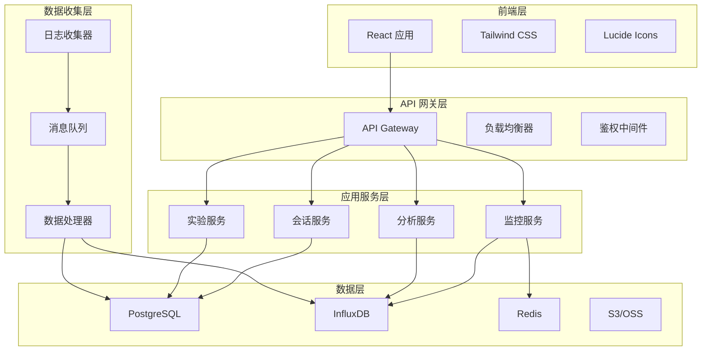

# KingSoft 技术架构设计文档

## 1. 架构概览

### 1.1 整体架构图



### 1.2 技术栈选择

| 层级 | 技术选择 | 选择理由 |
|-----|---------|---------|
| **前端** | React 18 + TypeScript | 组件化开发、类型安全、生态丰富 |
| **UI框架** | Tailwind CSS | 快速开发、高度可定制、性能优秀 |
| **构建工具** | Vite | 快速热重载、ES模块支持、插件丰富 |
| **状态管理** | React Hooks + Context | 轻量级、原生支持、学习成本低 |
| **图表库** | Recharts | React友好、响应式、文档完善 |
| **API调用** | Fetch API + SWR | 原生支持、数据缓存、错误处理 |

## 2. 前端架构设计

### 2.1 目录结构

```
src/
├── components/          # 通用组件
│   ├── Layout.tsx      # 布局组件
│   ├── Header.tsx      # 头部组件
│   ├── Sidebar.tsx     # 侧边栏组件
│   └── common/         # 通用UI组件
├── pages/              # 页面组件
│   ├── Dashboard.tsx   # 监控仪表盘
│   ├── Sessions.tsx    # 会话查询
│   ├── ABTesting.tsx   # A/B测试
│   └── Analytics.tsx   # 数据分析
├── hooks/              # 自定义Hooks
│   ├── useAPI.ts       # API调用
│   ├── useAuth.ts      # 认证逻辑
│   └── useRealtime.ts  # 实时数据
├── utils/              # 工具函数
│   ├── api.ts          # API封装
│   ├── format.ts       # 数据格式化
│   └── constants.ts    # 常量定义
├── types/              # TypeScript类型定义
│   ├── index.ts        # 主要类型
│   ├── api.ts          # API类型
│   └── common.ts       # 通用类型
├── data/               # 模拟数据
│   └── mockData.ts     # 演示数据
└── styles/             # 样式文件
    └── globals.css     # 全局样式
```

### 2.2 组件设计原则

#### 2.2.1 组件分层
```typescript
// 页面组件 (Pages)
const Dashboard = () => {
  // 业务逻辑
  // 数据获取
  // 状态管理
  return <DashboardLayout />;
};

// 布局组件 (Layouts)
const DashboardLayout = () => {
  return (
    <div>
      <MetricsSection />
      <ChartsSection />
    </div>
  );
};

// 业务组件 (Features)
const MetricsSection = () => {
  return (
    <Section>
      <MetricCard />
      <MetricCard />
    </Section>
  );
};

// 通用组件 (Common)
const MetricCard = ({ title, value, icon }) => {
  return (
    <Card>
      <CardHeader>{title}</CardHeader>
      <CardContent>{value}</CardContent>
    </Card>
  );
};
```

#### 2.2.2 Props类型设计
```typescript
// 基础组件Props
interface BaseComponentProps {
  className?: string;
  children?: React.ReactNode;
}

// 业务组件Props
interface MetricCardProps extends BaseComponentProps {
  title: string;
  value: string | number;
  icon: React.ComponentType;
  trend?: 'up' | 'down';
  trendValue?: string;
  color?: 'blue' | 'green' | 'red' | 'yellow';
}

// 页面组件Props
interface DashboardProps {
  initialData?: DashboardMetrics;
  refreshInterval?: number;
}
```

### 2.3 状态管理策略

#### 2.3.1 全局状态
```typescript
// contexts/AppContext.tsx
interface AppState {
  user: User | null;
  permissions: Permission[];
  theme: 'light' | 'dark';
  selectedTimeRange: TimeRange;
}

const AppContext = createContext<AppState & AppActions>();

// 使用示例
const Dashboard = () => {
  const { user, selectedTimeRange, setTimeRange } = useContext(AppContext);
  // ...
};
```

#### 2.3.2 局部状态
```typescript
// hooks/useSessionSearch.ts
export const useSessionSearch = () => {
  const [searchTerm, setSearchTerm] = useState('');
  const [filters, setFilters] = useState<SessionFilters>({});
  const [results, setResults] = useState<Session[]>([]);
  const [loading, setLoading] = useState(false);

  const search = useCallback(async () => {
    setLoading(true);
    try {
      const data = await searchSessions({ searchTerm, ...filters });
      setResults(data);
    } finally {
      setLoading(false);
    }
  }, [searchTerm, filters]);

  return { searchTerm, setSearchTerm, filters, setFilters, results, loading, search };
};
```

### 2.4 数据获取策略

#### 2.4.1 API封装
```typescript
// utils/api.ts
class APIClient {
  private baseURL: string;
  private token: string | null = null;

  constructor(baseURL: string) {
    this.baseURL = baseURL;
  }

  async request<T>(endpoint: string, options: RequestOptions = {}): Promise<T> {
    const url = `${this.baseURL}${endpoint}`;
    const headers = {
      'Content-Type': 'application/json',
      ...(this.token && { Authorization: `Bearer ${this.token}` }),
      ...options.headers,
    };

    const response = await fetch(url, {
      ...options,
      headers,
    });

    if (!response.ok) {
      throw new APIError(response.status, response.statusText);
    }

    return response.json();
  }

  // 业务方法
  getDashboardMetrics = (timeRange: string) => 
    this.request<DashboardMetrics>(`/metrics/dashboard?range=${timeRange}`);
    
  searchSessions = (query: SessionQuery) =>
    this.request<Session[]>('/sessions/search', {
      method: 'POST',
      body: JSON.stringify(query),
    });
}
```

#### 2.4.2 实时数据处理
```typescript
// hooks/useRealtime.ts
export const useRealtime = <T>(endpoint: string, interval: number = 30000) => {
  const [data, setData] = useState<T | null>(null);
  const [error, setError] = useState<Error | null>(null);

  useEffect(() => {
    let intervalId: NodeJS.Timeout;

    const fetchData = async () => {
      try {
        const response = await api.request<T>(endpoint);
        setData(response);
        setError(null);
      } catch (err) {
        setError(err as Error);
      }
    };

    // 立即执行一次
    fetchData();
    
    // 定时更新
    intervalId = setInterval(fetchData, interval);

    return () => clearInterval(intervalId);
  }, [endpoint, interval]);

  return { data, error, isLoading: data === null && error === null };
};
```

## 3. 性能优化策略

### 3.1 代码分割
```typescript
// 路由级别的代码分割
const Dashboard = lazy(() => import('./pages/Dashboard'));
const Sessions = lazy(() => import('./pages/Sessions'));
const ABTesting = lazy(() => import('./pages/ABTesting'));
const Analytics = lazy(() => import('./pages/Analytics'));

const App = () => (
  <Router>
    <Suspense fallback={<Loading />}>
      <Routes>
        <Route path="/" element={<Dashboard />} />
        <Route path="/sessions" element={<Sessions />} />
        <Route path="/ab-testing" element={<ABTesting />} />
        <Route path="/analytics" element={<Analytics />} />
      </Routes>
    </Suspense>
  </Router>
);
```

### 3.2 组件优化
```typescript
// 使用 React.memo 优化重渲染
const MetricCard = React.memo<MetricCardProps>(({ title, value, icon: Icon, trend }) => {
  return (
    <div className="bg-white rounded-lg shadow-sm border border-gray-200 p-6">
      <div className="flex items-center justify-between">
        <div>
          <p className="text-sm font-medium text-gray-600">{title}</p>
          <p className="text-3xl font-bold text-gray-900">{value}</p>
        </div>
        <Icon className="h-6 w-6" />
      </div>
    </div>
  );
});

// 使用 useMemo 优化计算
const Dashboard = () => {
  const { data: metrics } = useRealtime<DashboardMetrics>('/metrics/dashboard');
  
  const processedMetrics = useMemo(() => {
    if (!metrics) return null;
    
    return {
      ...metrics,
      successRate: (metrics.successSessions / metrics.totalSessions * 100).toFixed(1),
      failureRate: (metrics.failedSessions / metrics.totalSessions * 100).toFixed(1),
    };
  }, [metrics]);

  return <DashboardLayout metrics={processedMetrics} />;
};
```

### 3.3 数据缓存
```typescript
// hooks/useCache.ts
const cache = new Map<string, { data: any; timestamp: number; ttl: number }>();

export const useCache = <T>(key: string, fetcher: () => Promise<T>, ttl: number = 300000) => {
  const [data, setData] = useState<T | null>(null);
  const [loading, setLoading] = useState(false);

  useEffect(() => {
    const cached = cache.get(key);
    const now = Date.now();

    if (cached && now - cached.timestamp < cached.ttl) {
      setData(cached.data);
      return;
    }

    const fetchData = async () => {
      setLoading(true);
      try {
        const result = await fetcher();
        cache.set(key, { data: result, timestamp: now, ttl });
        setData(result);
      } finally {
        setLoading(false);
      }
    };

    fetchData();
  }, [key, fetcher, ttl]);

  return { data, loading };
};
```

## 4. 错误处理与监控

### 4.1 错误边界
```typescript
// components/ErrorBoundary.tsx
class ErrorBoundary extends React.Component<Props, State> {
  constructor(props: Props) {
    super(props);
    this.state = { hasError: false, error: null };
  }

  static getDerivedStateFromError(error: Error): State {
    return { hasError: true, error };
  }

  componentDidCatch(error: Error, errorInfo: React.ErrorInfo) {
    // 发送错误到监控服务
    console.error('Error caught by boundary:', error, errorInfo);
    
    // 可以发送到Sentry或其他错误监控服务
    // Sentry.captureException(error);
  }

  render() {
    if (this.state.hasError) {
      return (
        <div className="min-h-screen flex items-center justify-center">
          <div className="text-center">
            <h2 className="text-xl font-semibold text-gray-900 mb-2">
              出现了一些问题
            </h2>
            <p className="text-gray-600 mb-4">
              页面加载失败，请刷新页面重试
            </p>
            <button 
              onClick={() => window.location.reload()}
              className="bg-primary-600 text-white px-4 py-2 rounded-lg"
            >
              刷新页面
            </button>
          </div>
        </div>
      );
    }

    return this.props.children;
  }
}
```

### 4.2 API错误处理
```typescript
// utils/errorHandler.ts
export class APIError extends Error {
  constructor(public status: number, public statusText: string, public data?: any) {
    super(`API Error: ${status} ${statusText}`);
    this.name = 'APIError';
  }
}

export const handleAPIError = (error: APIError) => {
  switch (error.status) {
    case 401:
      // 未授权，跳转到登录页
      window.location.href = '/login';
      break;
    case 403:
      // 权限不足
      toast.error('权限不足，请联系管理员');
      break;
    case 500:
      // 服务器错误
      toast.error('服务器错误，请稍后重试');
      break;
    default:
      toast.error(error.message || '请求失败');
  }
};
```

## 5. 测试策略

### 5.1 单元测试
```typescript
// __tests__/components/MetricCard.test.tsx
import { render, screen } from '@testing-library/react';
import { MetricCard } from '../components/MetricCard';
import { Users } from 'lucide-react';

describe('MetricCard', () => {
  it('renders metric card with correct data', () => {
    render(
      <MetricCard
        title="活跃用户"
        value={1247}
        icon={Users}
        trend="up"
        trendValue="+12%"
      />
    );

    expect(screen.getByText('活跃用户')).toBeInTheDocument();
    expect(screen.getByText('1247')).toBeInTheDocument();
    expect(screen.getByText('+12%')).toBeInTheDocument();
  });

  it('handles different trend directions', () => {
    const { rerender } = render(
      <MetricCard title="测试" value={100} icon={Users} trend="up" trendValue="+5%" />
    );

    expect(screen.getByText('+5%')).toHaveClass('text-green-600');

    rerender(
      <MetricCard title="测试" value={100} icon={Users} trend="down" trendValue="-3%" />
    );

    expect(screen.getByText('-3%')).toHaveClass('text-red-600');
  });
});
```

### 5.2 集成测试
```typescript
// __tests__/pages/Dashboard.test.tsx
import { render, screen, waitFor } from '@testing-library/react';
import { Dashboard } from '../pages/Dashboard';
import { mockDashboardMetrics } from '../data/mockData';

// Mock API
jest.mock('../utils/api', () => ({
  getDashboardMetrics: jest.fn(() => Promise.resolve(mockDashboardMetrics)),
}));

describe('Dashboard Page', () => {
  it('renders dashboard with metrics', async () => {
    render(<Dashboard />);

    // 检查加载状态
    expect(screen.getByText('加载中...')).toBeInTheDocument();

    // 等待数据加载完成
    await waitFor(() => {
      expect(screen.getByText('全局监控仪表盘')).toBeInTheDocument();
      expect(screen.getByText('1,247')).toBeInTheDocument();
    });
  });
});
```

### 5.3 E2E测试
```typescript
// e2e/dashboard.spec.ts (Playwright)
import { test, expect } from '@playwright/test';

test('dashboard functionality', async ({ page }) => {
  await page.goto('/');

  // 检查页面标题
  await expect(page.locator('h1')).toContainText('全局监控仪表盘');

  // 检查指标卡片
  const metricCards = page.locator('.metric-card');
  await expect(metricCards).toHaveCount(4);

  // 检查实时更新
  const userCount = page.locator('[data-testid="active-users"]');
  const initialValue = await userCount.textContent();
  
  // 等待30秒后检查数据是否更新
  await page.waitForTimeout(30000);
  const updatedValue = await userCount.textContent();
  
  // 可能相同，也可能不同，主要是测试功能正常
  expect(updatedValue).toBeTruthy();
});
```

## 6. 构建与部署

### 6.1 构建配置
```typescript
// vite.config.ts
import { defineConfig } from 'vite';
import react from '@vitejs/plugin-react';
import { resolve } from 'path';

export default defineConfig({
  plugins: [react()],
  resolve: {
    alias: {
      '@': resolve(__dirname, 'src'),
      '@components': resolve(__dirname, 'src/components'),
      '@pages': resolve(__dirname, 'src/pages'),
      '@utils': resolve(__dirname, 'src/utils'),
      '@types': resolve(__dirname, 'src/types'),
    },
  },
  build: {
    rollupOptions: {
      output: {
        manualChunks: {
          vendor: ['react', 'react-dom'],
          router: ['react-router-dom'],
          ui: ['lucide-react'],
          charts: ['recharts'],
        },
      },
    },
    sourcemap: true,
    minify: 'terser',
    terserOptions: {
      compress: {
        drop_console: true,
        drop_debugger: true,
      },
    },
  },
  server: {
    port: 3000,
    open: true,
    proxy: {
      '/api': {
        target: 'http://localhost:8080',
        changeOrigin: true,
        rewrite: (path) => path.replace(/^\/api/, ''),
      },
    },
  },
});
```

### 6.2 Docker配置
```dockerfile
# Dockerfile
FROM node:18-alpine as builder

WORKDIR /app
COPY package*.json ./
RUN npm ci --only=production

COPY . .
RUN npm run build

FROM nginx:alpine
COPY --from=builder /app/dist /usr/share/nginx/html
COPY nginx.conf /etc/nginx/nginx.conf

EXPOSE 80
CMD ["nginx", "-g", "daemon off;"]
```

```nginx
# nginx.conf
server {
    listen 80;
    server_name localhost;
    root /usr/share/nginx/html;
    index index.html;

    # 处理 React Router
    location / {
        try_files $uri $uri/ /index.html;
    }

    # API 代理
    location /api/ {
        proxy_pass http://backend:8080/;
        proxy_set_header Host $host;
        proxy_set_header X-Real-IP $remote_addr;
        proxy_set_header X-Forwarded-For $proxy_add_x_forwarded_for;
        proxy_set_header X-Forwarded-Proto $scheme;
    }

    # 静态资源缓存
    location ~* \.(js|css|png|jpg|jpeg|gif|ico|svg)$ {
        expires 1y;
        add_header Cache-Control "public, immutable";
    }

    # 压缩
    gzip on;
    gzip_types text/plain text/css application/json application/javascript text/xml application/xml application/xml+rss text/javascript;
}
```

### 6.3 CI/CD配置
```yaml
# .github/workflows/deploy.yml
name: Deploy to Production

on:
  push:
    branches: [main]

jobs:
  test:
    runs-on: ubuntu-latest
    steps:
      - uses: actions/checkout@v3
      - uses: actions/setup-node@v3
        with:
          node-version: '18'
      - run: npm ci
      - run: npm run test
      - run: npm run build

  deploy:
    needs: test
    runs-on: ubuntu-latest
    steps:
      - uses: actions/checkout@v3
      - name: Build and push Docker image
        run: |
          docker build -t kingsoft-frontend:${{ github.sha }} .
          docker tag kingsoft-frontend:${{ github.sha }} kingsoft-frontend:latest
          docker push kingsoft-frontend:${{ github.sha }}
          docker push kingsoft-frontend:latest
      
      - name: Deploy to Kubernetes
        run: |
          kubectl set image deployment/kingsoft-frontend \
            kingsoft-frontend=kingsoft-frontend:${{ github.sha }}
          kubectl rollout status deployment/kingsoft-frontend
```

## 7. 监控与维护

### 7.1 性能监控
```typescript
// utils/performance.ts
export const trackPerformance = () => {
  // 页面加载性能
  window.addEventListener('load', () => {
    const navigation = performance.getEntriesByType('navigation')[0] as PerformanceNavigationTiming;
    const loadTime = navigation.loadEventEnd - navigation.loadEventStart;
    
    // 发送到监控服务
    console.log('Page load time:', loadTime);
  });

  // React组件渲染性能
  if (process.env.NODE_ENV === 'development') {
    import('react').then(({ Profiler }) => {
      const onRenderCallback = (id: string, phase: string, actualDuration: number) => {
        console.log(`Component ${id} rendered in ${actualDuration}ms`);
      };
      
      // 包装根组件
      // <Profiler id="App" onRender={onRenderCallback}>
      //   <App />
      // </Profiler>
    });
  }
};
```

### 7.2 错误监控
```typescript
// utils/monitoring.ts
export const initMonitoring = () => {
  // 全局错误处理
  window.addEventListener('error', (event) => {
    console.error('Global error:', event.error);
    // 发送到错误监控服务
    // Sentry.captureException(event.error);
  });

  // Promise rejection 处理
  window.addEventListener('unhandledrejection', (event) => {
    console.error('Unhandled promise rejection:', event.reason);
    // 发送到错误监控服务
    // Sentry.captureException(event.reason);
  });

  // 资源加载错误
  window.addEventListener('error', (event) => {
    if (event.target !== window) {
      console.error('Resource load error:', event.target);
    }
  }, true);
};
```

## 8. 安全考虑

### 8.1 内容安全策略
```html
<!-- index.html -->
<meta http-equiv="Content-Security-Policy" content="
  default-src 'self';
  script-src 'self' 'unsafe-inline';
  style-src 'self' 'unsafe-inline';
  img-src 'self' data: https:;
  connect-src 'self' https://api.kingsoft.com;
  font-src 'self';
">
```

### 8.2 XSS防护
```typescript
// utils/sanitize.ts
import DOMPurify from 'dompurify';

export const sanitizeHTML = (html: string): string => {
  return DOMPurify.sanitize(html);
};

export const escapeHTML = (str: string): string => {
  return str
    .replace(/&/g, '&amp;')
    .replace(/</g, '&lt;')
    .replace(/>/g, '&gt;')
    .replace(/"/g, '&quot;')
    .replace(/'/g, '&#x27;');
};
```

### 8.3 认证与授权
```typescript
// hooks/useAuth.ts
export const useAuth = () => {
  const [user, setUser] = useState<User | null>(null);
  const [token, setToken] = useState<string | null>(localStorage.getItem('token'));

  const login = async (credentials: LoginCredentials) => {
    const response = await api.login(credentials);
    setToken(response.token);
    setUser(response.user);
    localStorage.setItem('token', response.token);
  };

  const logout = () => {
    setToken(null);
    setUser(null);
    localStorage.removeItem('token');
  };

  const hasPermission = (permission: string) => {
    return user?.permissions.includes(permission) || false;
  };

  return { user, token, login, logout, hasPermission };
};
```

这份技术架构文档涵盖了前端的核心设计理念、实现策略和最佳实践，为开发团队提供了完整的技术指导。