# 数据采集与埋点层技术设计文档

**文档版本：** V1.0  
**创建日期：** 2024-08-25  
**文档目标：** 为LLM+MCP数字员工系统提供完整的可观测性数据采集解决方案

---

## 1. 系统架构概览

### 1.1 整体数据流架构

```mermaid
graph TB
    subgraph "数字员工应用层"
        DE[Digital Employee]
        LLM[LLM调用]
        MCP[MCP工具调用]
        BIZ[业务逻辑]
    end
    
    subgraph "数据采集层"
        SDK[OTel SDK]
        AUTO[自动埋点]
        MANUAL[手动埋点]
        BATCH[批量上报]
    end
    
    subgraph "数据传输层"
        COLL[OTLP Collector]
        MQ[消息队列]
        BUFF[缓冲区]
    end
    
    subgraph "数据处理层"
        PROC[流处理引擎]
        ETL[ETL管道]
        AGG[实时聚合]
    end
    
    subgraph "存储层"
        TRACE[链路存储]
        METRIC[指标存储]
        LOG[日志存储]
    end
    
    DE --> SDK
    LLM --> AUTO
    MCP --> AUTO
    BIZ --> MANUAL
    
    SDK --> COLL
    AUTO --> COLL
    MANUAL --> COLL
    BATCH --> COLL
    
    COLL --> MQ
    MQ --> PROC
    PROC --> ETL
    ETL --> AGG
    
    AGG --> TRACE
    AGG --> METRIC
    AGG --> LOG
```



### 1.2 核心组件说明

| 组件 | 职责 | 技术选型 | 部署方式 |
|------|------|----------|----------|
| **OTel SDK** | 统一埋点接口 | OpenTelemetry JS/Python | 应用内集成 |
| **自动埋点** | LLM/MCP调用自动追踪 | 自研Interceptor | 应用内集成 |
| **OTLP Collector** | 数据收集和预处理 | OpenTelemetry Collector | 独立部署 |
| **消息队列** | 数据缓冲和削峰 | Kafka/Redis Streams | 集群部署 |
| **流处理** | 实时数据处理 | Apache Flink/Node.js Stream | 集群部署 |

---

## 2. OpenTelemetry集成设计

### 2.1 SDK初始化配置

```typescript
// src/instrumentation/otel-setup.ts
import { NodeSDK } from '@opentelemetry/sdk-node';
import { Resource } from '@opentelemetry/resources';
import { SemanticResourceAttributes } from '@opentelemetry/semantic-conventions';
import { OTLPTraceExporter } from '@opentelemetry/exporter-otlp-http';
import { OTLPMetricExporter } from '@opentelemetry/exporter-otlp-http';

export class DigitalEmployeeInstrumentation {
  private sdk: NodeSDK;
  
  constructor(config: InstrumentationConfig) {
    this.sdk = new NodeSDK({
      resource: new Resource({
        [SemanticResourceAttributes.SERVICE_NAME]: 'digital-employee',
        [SemanticResourceAttributes.SERVICE_VERSION]: config.version,
        [SemanticResourceAttributes.DEPLOYMENT_ENVIRONMENT]: config.environment,
        // 自定义属性
        'de.model.provider': config.modelProvider,
        'de.mcp.version': config.mcpVersion,
      }),
      
      traceExporter: new OTLPTraceExporter({
        url: config.otlpEndpoint + '/v1/traces',
        headers: {
          'Authorization': `Bearer ${config.apiKey}`
        }
      }),
      
      metricExporter: new OTLPMetricExporter({
        url: config.otlpEndpoint + '/v1/metrics',
        headers: {
          'Authorization': `Bearer ${config.apiKey}`
        }
      }),
      
      instrumentations: [
        // 自动集成HTTP、数据库等
        getNodeAutoInstrumentations(),
        // 自定义LLM指令
        new LLMInstrumentation(),
        // 自定义MCP指令  
        new MCPInstrumentation(),
      ],
    });
  }
  
  start(): void {
    this.sdk.start();
    console.log('Digital Employee instrumentation started');
  }
  
  shutdown(): Promise<void> {
    return this.sdk.shutdown();
  }
}

interface InstrumentationConfig {
  version: string;
  environment: 'development' | 'staging' | 'production';
  modelProvider: string;
  mcpVersion: string;
  otlpEndpoint: string;
  apiKey: string;
}
```

### 2.2 LLM调用自动埋点

```typescript
// src/instrumentation/llm-instrumentation.ts
import { InstrumentationBase } from '@opentelemetry/instrumentation';
import { trace, context, SpanKind, SpanStatusCode } from '@opentelemetry/api';

export class LLMInstrumentation extends InstrumentationBase {
  constructor() {
    super('llm-instrumentation', '1.0.0');
  }
  
  protected init() {
    // 拦截所有LLM调用
    this.interceptLLMCalls();
  }
  
  private interceptLLMCalls() {
    const tracer = trace.getTracer('llm-tracer');
    
    // 包装OpenAI调用
    this.wrapMethod('openai', 'chat.completions.create', (original) => {
      return async function(this: any, params: any) {
        const span = tracer.startSpan('llm.chat.completion', {
          kind: SpanKind.CLIENT,
          attributes: {
            'llm.request.model': params.model,
            'llm.request.max_tokens': params.max_tokens,
            'llm.request.temperature': params.temperature,
            'llm.request.messages.count': params.messages?.length || 0,
          }
        });
        
        const startTime = Date.now();
        
        try {
          const response = await original.call(this, params);
          
          const endTime = Date.now();
          const duration = endTime - startTime;
          
          span.setAttributes({
            'llm.response.model': response.model,
            'llm.response.finish_reason': response.choices[0]?.finish_reason,
            'llm.response.completion_tokens': response.usage?.completion_tokens,
            'llm.response.prompt_tokens': response.usage?.prompt_tokens,
            'llm.response.total_tokens': response.usage?.total_tokens,
            'llm.response.duration_ms': duration,
            'llm.response.cost_usd': calculateCost(response.model, response.usage),
          });
          
          span.setStatus({ code: SpanStatusCode.OK });
          return response;
          
        } catch (error) {
          span.recordException(error as Error);
          span.setStatus({ 
            code: SpanStatusCode.ERROR, 
            message: (error as Error).message 
          });
          throw error;
        } finally {
          span.end();
        }
      };
    });
  }
}

function calculateCost(model: string, usage: any): number {
  const pricing: Record<string, { input: number; output: number }> = {
    'gpt-4': { input: 0.03, output: 0.06 },
    'gpt-3.5-turbo': { input: 0.001, output: 0.002 },
    'claude-3-sonnet': { input: 0.003, output: 0.015 },
  };
  
  const modelPricing = pricing[model] || { input: 0, output: 0 };
  
  return (
    (usage.prompt_tokens * modelPricing.input / 1000) +
    (usage.completion_tokens * modelPricing.output / 1000)
  );
}
```

### 2.3 MCP工具调用埋点

```typescript
// src/instrumentation/mcp-instrumentation.ts
export class MCPInstrumentation extends InstrumentationBase {
  constructor() {
    super('mcp-instrumentation', '1.0.0');
  }
  
  protected init() {
    this.interceptMCPCalls();
  }
  
  private interceptMCPCalls() {
    const tracer = trace.getTracer('mcp-tracer');
    
    // 包装MCP工具调用
    this.wrapMethod('mcp-client', 'callTool', (original) => {
      return async function(this: any, toolName: string, params: any) {
        const span = tracer.startSpan('mcp.tool.call', {
          kind: SpanKind.CLIENT,
          attributes: {
            'mcp.tool.name': toolName,
            'mcp.tool.parameters': JSON.stringify(params),
            'mcp.tool.parameters_count': Object.keys(params || {}).length,
          }
        });
        
        const startTime = Date.now();
        
        try {
          const result = await original.call(this, toolName, params);
          
          const endTime = Date.now();
          const duration = endTime - startTime;
          
          span.setAttributes({
            'mcp.tool.result.success': true,
            'mcp.tool.result.duration_ms': duration,
            'mcp.tool.result.size_bytes': JSON.stringify(result).length,
            'mcp.tool.result.type': typeof result,
          });
          
          // 记录工具特定的指标
          this.recordToolSpecificMetrics(toolName, duration, true);
          
          span.setStatus({ code: SpanStatusCode.OK });
          return result;
          
        } catch (error) {
          const endTime = Date.now();
          const duration = endTime - startTime;
          
          span.recordException(error as Error);
          span.setAttributes({
            'mcp.tool.result.success': false,
            'mcp.tool.result.duration_ms': duration,
            'mcp.tool.error.type': (error as Error).constructor.name,
            'mcp.tool.error.message': (error as Error).message,
          });
          
          this.recordToolSpecificMetrics(toolName, duration, false);
          
          span.setStatus({ 
            code: SpanStatusCode.ERROR, 
            message: (error as Error).message 
          });
          throw error;
        } finally {
          span.end();
        }
      };
    });
  }
  
  private recordToolSpecificMetrics(toolName: string, duration: number, success: boolean) {
    const meter = metrics.getMeter('mcp-tools');
    
    // 调用次数计数器
    const callCounter = meter.createCounter('mcp.tool.calls.total', {
      description: 'Total number of MCP tool calls'
    });
    
    callCounter.add(1, {
      'tool_name': toolName,
      'success': success.toString(),
    });
    
    // 调用延迟直方图
    const latencyHistogram = meter.createHistogram('mcp.tool.duration', {
      description: 'MCP tool call duration in milliseconds',
      unit: 'ms',
    });
    
    latencyHistogram.record(duration, {
      'tool_name': toolName,
      'success': success.toString(),
    });
  }
}
```

---

## 3. 业务事件埋点框架

### 3.1 业务事件定义

```typescript
// src/instrumentation/business-events.ts
export interface BusinessEvent {
  eventType: string;
  eventId: string;
  timestamp: number;
  userId?: string;
  sessionId?: string;
  traceId?: string;
  properties: Record<string, any>;
  metrics: Record<string, number>;
}

export enum BusinessEventTypes {
  // 用户交互事件
  USER_SESSION_START = 'user.session.start',
  USER_SESSION_END = 'user.session.end',
  USER_MESSAGE_SENT = 'user.message.sent',
  
  // 任务相关事件
  TASK_STARTED = 'task.started',
  TASK_COMPLETED = 'task.completed',
  TASK_FAILED = 'task.failed',
  TASK_ABANDONED = 'task.abandoned',
  
  // 系统事件
  SYSTEM_ERROR = 'system.error',
  SYSTEM_FALLBACK = 'system.fallback',
  SYSTEM_CLARIFICATION_REQUESTED = 'system.clarification.requested',
  
  // 业务成果事件
  VALUE_CREATED = 'business.value.created',
  USER_SATISFACTION_RECORDED = 'business.satisfaction.recorded',
  GOAL_ACHIEVED = 'business.goal.achieved',
}

export class BusinessEventTracker {
  private tracer = trace.getTracer('business-events');
  private meter = metrics.getMeter('business-metrics');
  
  track(event: BusinessEvent): void {
    // 在当前Span中记录业务事件
    const activeSpan = trace.getActiveSpan();
    if (activeSpan) {
      activeSpan.addEvent(event.eventType, {
        'event.id': event.eventId,
        'event.timestamp': event.timestamp,
        'event.properties': JSON.stringify(event.properties),
      });
    }
    
    // 记录为独立的业务指标
    this.recordBusinessMetrics(event);
    
    // 发送到业务分析系统
    this.sendToAnalytics(event);
  }
  
  private recordBusinessMetrics(event: BusinessEvent): void {
    const eventCounter = this.meter.createCounter('business.events.total', {
      description: 'Total number of business events'
    });
    
    eventCounter.add(1, {
      'event_type': event.eventType,
      'user_id': event.userId || 'anonymous',
    });
    
    // 记录业务指标
    Object.entries(event.metrics).forEach(([key, value]) => {
      const gauge = this.meter.createObservableGauge(`business.metric.${key}`, {
        description: `Business metric: ${key}`
      });
      
      gauge.addCallback((result) => {
        result.observe(value, {
          'event_type': event.eventType,
          'event_id': event.eventId,
        });
      });
    });
  }
  
  private sendToAnalytics(event: BusinessEvent): void {
    // 异步发送到分析后端
    setImmediate(() => {
      analyticsClient.track(event);
    });
  }
}
```

### 3.2 使用示例

```typescript
// 在数字员工业务代码中使用
export class DigitalEmployee {
  private eventTracker = new BusinessEventTracker();
  
  async processUserMessage(message: string, userId: string, sessionId: string): Promise<string> {
    // 开始任务追踪
    const taskId = generateTaskId();
    this.eventTracker.track({
      eventType: BusinessEventTypes.TASK_STARTED,
      eventId: taskId,
      timestamp: Date.now(),
      userId,
      sessionId,
      traceId: trace.getActiveSpan()?.spanContext().traceId,
      properties: {
        message_length: message.length,
        message_type: classifyMessage(message),
      },
      metrics: {
        complexity_score: calculateComplexity(message),
      }
    });
    
    try {
      const response = await this.generateResponse(message);
      
      // 任务完成事件
      this.eventTracker.track({
        eventType: BusinessEventTypes.TASK_COMPLETED,
        eventId: taskId,
        timestamp: Date.now(),
        userId,
        sessionId,
        traceId: trace.getActiveSpan()?.spanContext().traceId,
        properties: {
          response_length: response.length,
          tools_used: this.getUsedTools(),
        },
        metrics: {
          task_duration_ms: Date.now() - startTime,
          user_value_score: calculateValueScore(response),
        }
      });
      
      return response;
    } catch (error) {
      // 任务失败事件
      this.eventTracker.track({
        eventType: BusinessEventTypes.TASK_FAILED,
        eventId: taskId,
        timestamp: Date.now(),
        userId,
        sessionId,
        properties: {
          error_type: error.constructor.name,
          error_message: error.message,
        },
        metrics: {
          task_duration_ms: Date.now() - startTime,
        }
      });
      
      throw error;
    }
  }
}
```

---

## 4. 数据上报与缓冲策略

### 4.1 批量上报机制

```typescript
// src/instrumentation/batch-exporter.ts
export class BatchExporter {
  private queue: any[] = [];
  private timer: NodeJS.Timeout | null = null;
  private readonly maxBatchSize: number = 100;
  private readonly maxBatchDelay: number = 5000; // 5秒
  
  constructor(private exporter: any) {}
  
  export(data: any): void {
    this.queue.push(data);
    
    if (this.queue.length >= this.maxBatchSize) {
      this.flush();
    } else if (!this.timer) {
      this.timer = setTimeout(() => this.flush(), this.maxBatchDelay);
    }
  }
  
  private async flush(): Promise<void> {
    if (this.queue.length === 0) return;
    
    const batch = this.queue.splice(0, this.maxBatchSize);
    
    if (this.timer) {
      clearTimeout(this.timer);
      this.timer = null;
    }
    
    try {
      await this.exporter.export(batch);
    } catch (error) {
      console.error('Failed to export batch:', error);
      // 可以选择重新入队列或丢弃
      this.handleExportFailure(batch, error);
    }
  }
  
  private handleExportFailure(batch: any[], error: Error): void {
    // 简单重试策略
    if (batch.length < this.maxBatchSize) {
      // 重新插入队列头部
      this.queue.unshift(...batch);
    } else {
      // 记录丢失的数据
      console.warn(`Dropped ${batch.length} items due to export failure:`, error.message);
    }
  }
}
```

### 4.2 本地缓存机制

```typescript
// src/instrumentation/local-cache.ts
import * as fs from 'fs';
import * as path from 'path';

export class LocalDataCache {
  private cacheDir: string;
  private maxCacheSize: number = 100 * 1024 * 1024; // 100MB
  
  constructor(cacheDir: string = './otel-cache') {
    this.cacheDir = cacheDir;
    this.ensureCacheDir();
  }
  
  private ensureCacheDir(): void {
    if (!fs.existsSync(this.cacheDir)) {
      fs.mkdirSync(this.cacheDir, { recursive: true });
    }
  }
  
  cache(data: any): void {
    const filename = `cache-${Date.now()}-${Math.random().toString(36).slice(2)}.json`;
    const filepath = path.join(this.cacheDir, filename);
    
    try {
      fs.writeFileSync(filepath, JSON.stringify(data));
      this.cleanupOldCache();
    } catch (error) {
      console.error('Failed to cache data locally:', error);
    }
  }
  
  getCachedData(): any[] {
    const files = fs.readdirSync(this.cacheDir)
      .filter(file => file.startsWith('cache-') && file.endsWith('.json'))
      .sort();
    
    const data: any[] = [];
    
    for (const file of files) {
      try {
        const filepath = path.join(this.cacheDir, file);
        const content = fs.readFileSync(filepath, 'utf-8');
        data.push(JSON.parse(content));
        fs.unlinkSync(filepath); // 读取后删除
      } catch (error) {
        console.error(`Failed to read cache file ${file}:`, error);
      }
    }
    
    return data;
  }
  
  private cleanupOldCache(): void {
    try {
      const files = fs.readdirSync(this.cacheDir);
      let totalSize = 0;
      
      const fileStats = files.map(file => {
        const filepath = path.join(this.cacheDir, file);
        const stats = fs.statSync(filepath);
        totalSize += stats.size;
        return { file, filepath, size: stats.size, mtime: stats.mtime };
      });
      
      if (totalSize > this.maxCacheSize) {
        // 按修改时间排序，删除最老的文件
        fileStats.sort((a, b) => a.mtime.getTime() - b.mtime.getTime());
        
        for (const { filepath, size } of fileStats) {
          if (totalSize <= this.maxCacheSize * 0.8) break;
          
          fs.unlinkSync(filepath);
          totalSize -= size;
        }
      }
    } catch (error) {
      console.error('Failed to cleanup cache:', error);
    }
  }
}
```

---

## 5. 部署与配置指南

### 5.1 Docker容器化部署

```dockerfile
# Dockerfile.instrumentation
FROM node:18-alpine

WORKDIR /app

# 安装依赖
COPY package*.json ./
RUN npm ci --only=production

# 复制源码
COPY src/ ./src/
COPY dist/ ./dist/

# 环境变量
ENV OTEL_SERVICE_NAME=digital-employee
ENV OTEL_EXPORTER_OTLP_ENDPOINT=http://otel-collector:4318
ENV OTEL_RESOURCE_ATTRIBUTES=service.name=digital-employee,service.version=1.0.0

# 启动脚本
COPY start.sh ./
RUN chmod +x start.sh

CMD ["./start.sh"]
```

### 5.2 Kubernetes部署配置

```yaml
# k8s/instrumentation-deployment.yaml
apiVersion: apps/v1
kind: Deployment
metadata:
  name: digital-employee-instrumented
  labels:
    app: digital-employee
    version: instrumented
spec:
  replicas: 3
  selector:
    matchLabels:
      app: digital-employee
      version: instrumented
  template:
    metadata:
      labels:
        app: digital-employee
        version: instrumented
      annotations:
        # Prometheus采集注解
        prometheus.io/scrape: "true"
        prometheus.io/port: "8080"
        prometheus.io/path: "/metrics"
    spec:
      containers:
      - name: digital-employee
        image: digital-employee:instrumented
        ports:
        - containerPort: 8080
          name: http
        - containerPort: 8081
          name: metrics
        env:
        - name: OTEL_SERVICE_NAME
          value: "digital-employee"
        - name: OTEL_EXPORTER_OTLP_ENDPOINT
          value: "http://otel-collector.monitoring.svc.cluster.local:4318"
        - name: OTEL_RESOURCE_ATTRIBUTES
          value: "service.name=digital-employee,service.version=1.0.0,k8s.namespace.name=$(NAMESPACE),k8s.pod.name=$(POD_NAME)"
        - name: NAMESPACE
          valueFrom:
            fieldRef:
              fieldPath: metadata.namespace
        - name: POD_NAME
          valueFrom:
            fieldRef:
              fieldPath: metadata.name
        resources:
          requests:
            memory: "256Mi"
            cpu: "100m"
          limits:
            memory: "512Mi"
            cpu: "500m"
        livenessProbe:
          httpGet:
            path: /health
            port: 8080
          initialDelaySeconds: 30
          periodSeconds: 10
        readinessProbe:
          httpGet:
            path: /ready
            port: 8080
          initialDelaySeconds: 5
          periodSeconds: 5
      - name: otel-agent
        image: otel/opentelemetry-collector-contrib:latest
        args: ["--config=/etc/config/otel-agent-config.yaml"]
        volumeMounts:
        - name: otel-agent-config
          mountPath: /etc/config
        resources:
          requests:
            memory: "128Mi"
            cpu: "50m"
          limits:
            memory: "256Mi"
            cpu: "200m"
      volumes:
      - name: otel-agent-config
        configMap:
          name: otel-agent-config
```

### 5.3 配置文件模板

```yaml
# config/otel-collector-config.yaml
receivers:
  otlp:
    protocols:
      grpc:
        endpoint: 0.0.0.0:4317
      http:
        endpoint: 0.0.0.0:4318
        
  prometheus:
    config:
      scrape_configs:
        - job_name: 'digital-employee'
          static_configs:
            - targets: ['localhost:8081']

processors:
  batch:
    timeout: 5s
    send_batch_size: 1024
    
  resource:
    attributes:
      - key: service.name
        value: "digital-employee"
        action: upsert
      - key: deployment.environment
        from_attribute: "env"
        action: insert
        
  memory_limiter:
    limit_mib: 512

exporters:
  # Jaeger for traces
  jaeger:
    endpoint: jaeger-collector:14250
    tls:
      insecure: true
      
  # Prometheus for metrics
  prometheus:
    endpoint: "0.0.0.0:8889"
    
  # Kafka for raw data
  kafka:
    brokers: ["kafka:9092"]
    topic: "otel-data"
    
  # Logging exporter for debugging
  logging:
    loglevel: info

service:
  pipelines:
    traces:
      receivers: [otlp]
      processors: [memory_limiter, resource, batch]
      exporters: [jaeger, kafka, logging]
      
    metrics:
      receivers: [otlp, prometheus]
      processors: [memory_limiter, resource, batch]
      exporters: [prometheus, kafka]
      
  extensions: [health_check, pprof, zpages]
  
  telemetry:
    logs:
      level: "info"
    metrics:
      address: 0.0.0.0:8888
```

---

## 6. 监控与告警配置

### 6.1 关键指标定义

```yaml
# monitoring/alerts.yaml
groups:
- name: digital-employee-instrumentation
  rules:
  
  # 数据采集健康度
  - alert: InstrumentationDataLoss
    expr: increase(otelcol_exporter_send_failed_total[5m]) > 10
    for: 2m
    labels:
      severity: critical
    annotations:
      summary: "数据采集出现丢失"
      description: "在过去5分钟内有{{ $value }}次数据发送失败"
      
  # LLM调用监控
  - alert: HighLLMLatency
    expr: histogram_quantile(0.95, rate(llm_request_duration_seconds_bucket[5m])) > 10
    for: 5m
    labels:
      severity: warning
    annotations:
      summary: "LLM调用延迟过高"
      description: "95%的LLM调用延迟超过10秒"
      
  # MCP工具调用监控
  - alert: HighMCPFailureRate
    expr: rate(mcp_tool_calls_failed_total[5m]) / rate(mcp_tool_calls_total[5m]) > 0.05
    for: 3m
    labels:
      severity: critical
    annotations:
      summary: "MCP工具调用失败率过高"
      description: "MCP工具调用失败率为{{ $value | humanizePercentage }}"
      
  # 业务指标监控
  - alert: LowTaskSuccessRate
    expr: rate(business_events_total{event_type="task.completed"}[10m]) / rate(business_events_total{event_type="task.started"}[10m]) < 0.8
    for: 5m
    labels:
      severity: warning
    annotations:
      summary: "任务成功率下降"
      description: "过去10分钟任务成功率为{{ $value | humanizePercentage }}"
```

### 6.2 Grafana仪表板配置

```json
{
  "dashboard": {
    "title": "数字员工可观测性仪表板",
    "panels": [
      {
        "title": "LLM调用统计",
        "type": "stat",
        "targets": [
          {
            "expr": "sum(rate(llm_requests_total[5m]))",
            "legendFormat": "每秒调用数"
          }
        ]
      },
      {
        "title": "Token成本趋势",
        "type": "graph",
        "targets": [
          {
            "expr": "sum(rate(llm_tokens_cost_total[5m])) by (model)",
            "legendFormat": "{{model}}"
          }
        ]
      },
      {
        "title": "MCP工具调用热力图",
        "type": "heatmap",
        "targets": [
          {
            "expr": "sum(rate(mcp_tool_duration_bucket[5m])) by (le, tool_name)",
            "format": "heatmap"
          }
        ]
      }
    ]
  }
}
```

---

## 7. 性能优化与最佳实践

### 7.1 采样策略

```typescript
// 智能采样策略
export class AdaptiveSampler {
  private baseRate: number = 0.1; // 10%基础采样率
  private errorRate: number = 1.0;  // 100%错误采样
  private slowRate: number = 0.5;   // 50%慢请求采样
  
  shouldSample(context: SamplingContext): boolean {
    // 错误请求100%采样
    if (context.hasError) {
      return true;
    }
    
    // 慢请求高采样率
    if (context.duration > 5000) { // 5秒以上
      return Math.random() < this.slowRate;
    }
    
    // 根据系统负载动态调整采样率
    const currentLoad = this.getCurrentSystemLoad();
    const adaptiveRate = this.baseRate * (2 - currentLoad); // 负载高时减少采样
    
    return Math.random() < Math.max(0.01, adaptiveRate); // 最低1%采样率
  }
  
  private getCurrentSystemLoad(): number {
    // 实现系统负载检测逻辑
    return 0.5; // 示例值
  }
}
```

### 7.2 内存优化

```typescript
// 内存使用优化
export class MemoryOptimizedExporter {
  private maxMemoryUsage: number = 100 * 1024 * 1024; // 100MB
  private compressionThreshold: number = 1024; // 1KB
  
  export(data: any[]): Promise<void> {
    // 检查内存使用
    const memoryUsage = process.memoryUsage();
    if (memoryUsage.heapUsed > this.maxMemoryUsage) {
      // 触发垃圾回收
      if (global.gc) {
        global.gc();
      }
      
      // 降级处理
      return this.exportSampled(data, 0.1);
    }
    
    // 压缩大数据
    const compressedData = data.map(item => {
      const serialized = JSON.stringify(item);
      if (serialized.length > this.compressionThreshold) {
        return this.compressData(item);
      }
      return item;
    });
    
    return this.doExport(compressedData);
  }
  
  private compressData(data: any): any {
    // 实现数据压缩逻辑
    return data;
  }
  
  private exportSampled(data: any[], sampleRate: number): Promise<void> {
    const sampledData = data.filter(() => Math.random() < sampleRate);
    return this.doExport(sampledData);
  }
}
```

---

## 8. 故障排除指南

### 8.1 常见问题诊断

| 问题 | 症状 | 排查步骤 | 解决方案 |
|------|------|----------|----------|
| **数据丢失** | 前端收不到数据 | 1. 检查OTLP Collector状态<br>2. 查看消息队列积压<br>3. 检查网络连接 | 1. 重启Collector<br>2. 扩容处理能力<br>3. 修复网络问题 |
| **高延迟** | 响应时间变长 | 1. 检查埋点代码性能<br>2. 查看批量处理配置<br>3. 分析网络延迟 | 1. 优化埋点逻辑<br>2. 调整批量大小<br>3. 优化网络配置 |
| **内存泄漏** | 内存使用持续增长 | 1. 检查缓存配置<br>2. 分析对象引用<br>3. 监控垃圾回收 | 1. 调整缓存策略<br>2. 修复内存泄漏<br>3. 优化GC配置 |

### 8.2 调试工具

```typescript
// 调试和诊断工具
export class InstrumentationDebugger {
  enableDebugMode(): void {
    // 启用详细日志
    process.env.OTEL_LOG_LEVEL = 'DEBUG';
    
    // 启用内存监控
    setInterval(() => {
      const usage = process.memoryUsage();
      console.log('Memory usage:', {
        heapUsed: Math.round(usage.heapUsed / 1024 / 1024) + 'MB',
        heapTotal: Math.round(usage.heapTotal / 1024 / 1024) + 'MB',
        external: Math.round(usage.external / 1024 / 1024) + 'MB',
        rss: Math.round(usage.rss / 1024 / 1024) + 'MB',
      });
    }, 10000);
    
    // 启用性能监控
    this.enablePerformanceMonitoring();
  }
  
  private enablePerformanceMonitoring(): void {
    const { PerformanceObserver, performance } = require('perf_hooks');
    
    const obs = new PerformanceObserver((list) => {
      list.getEntries().forEach((entry) => {
        console.log(`Performance: ${entry.name} took ${entry.duration}ms`);
      });
    });
    
    obs.observe({ entryTypes: ['measure', 'mark'] });
  }
  
  dumpTraceDebugInfo(): void {
    const activeSpan = trace.getActiveSpan();
    if (activeSpan) {
      const spanContext = activeSpan.spanContext();
      console.log('Active Trace Debug Info:', {
        traceId: spanContext.traceId,
        spanId: spanContext.spanId,
        traceFlags: spanContext.traceFlags,
      });
    }
  }
}
```

---

此文档提供了完整的数据采集与埋点层设计方案，为后续的系统集成和部署提供了详细的技术指导。

**下一步行动：**
1. 根据具体的数字员工技术栈调整SDK集成方案
2. 选择合适的部署架构（单机/分布式）
3. 实施渐进式部署策略，从简单场景开始
4. 建立完整的监控和告警体系