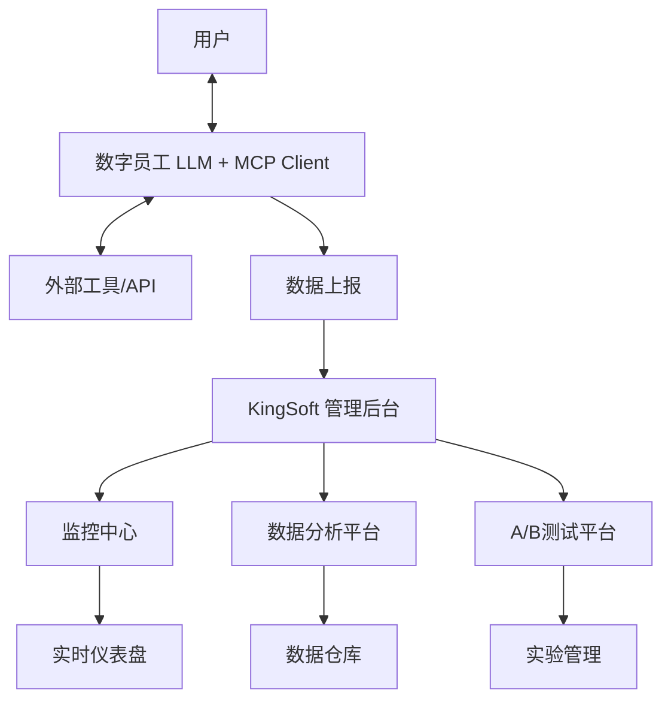

# KingSoft - 数字员工智能管理平台
## 产品需求文档 (PRD)

**文件状态：** 正式版  
**产品名称：** KingSoft - 数字员工智能管理平台  
**版本号：** V1.0  
**创建日期：** 2024-05-21  
**最后更新：** 2024-08-21  
**创建人：** 产品团队  

---

## 1. 文档简介

### 1.1 项目概述

随着公司数字员工（采用LLM+MCP架构）数量的增长和任务复杂度的提升，急需一个集中的管理后台来确保其服务的可靠性、可控性和持续优化能力。本项目旨在建设"KingSoft"平台，为核心团队提供实时监控、深入分析和A/B实验能力，从而保障数字员工高效、稳定落地，并通过数据驱动其性能迭代。

### 1.2 目标与范围

**核心目标：**
- **可视化监控：** 对数字员工的服务过程（LLM推理、工具调用）进行实时追踪与可视化，快速定位问题
- **效能分析：** 收集与分析交互数据，评估数字员工的性能、成本及用户满意度
- **A/B实验：** 支持对数字员工的不同版本（如不同提示词、不同模型、不同工具链）进行对比测试，以数据驱动决策
- **运营支撑：** 为产品、运营和研发团队提供高效的问题排查和优化工具

**范围：**
- **本期（V1.0）：** 实现核心监控仪表盘、会话详情追溯、基础A/B测试框架及看板
- **未来考虑：** 告警机制、自动化报表、更复杂的实验策略（如多变量测试）、知识库管理、模型微调集成

### 1.3 名词解释

| 术语 | 定义 |
|-----|------|
| **数字员工 (Digital Employee)** | 基于LLM和MCP构建的，能够执行特定任务（如客服、数据分析、内容生成等）的AI智能体 |
| **LLM (大语言模型)** | 如 GPT-4, Claude, Llama 等，负责核心推理与对话生成 |
| **MCP (模型上下文协议)** | 一种协议，用于LLM安全、结构化地调用外部工具（如API、数据库、函数） |
| **会话 (Session)** | 一次用户与数字员工的完整交互过程，通常由多轮对话组成 |
| **工具调用 (Tool Call)** | 数字员工通过MCP请求执行一个外部操作（如查询数据库、发送邮件） |
| **A/B测试** | 将用户流量随机分配至不同版本（A组和B组）的数字员工，通过对比关键指标来确定最优版本 |

---

## 2. 用户角色与画像

| 角色 | 核心职责 | 需求与痛点 |
|-----|---------|-----------|
| **产品经理** | 设计数字员工流程，分析效果，决策优化方向 | • 无法量化数字员工表现 • 不知道哪种提示词或模型效果更好 • 缺乏数据做决策 |
| **运营人员** | 监控数字员工日常运行，处理异常，查看用户反馈 | • 问题发生后无法快速定位根源 • 缺乏实时健康状态视图 • 需要快速响应用户投诉 |
| **AI工程师/研发** | 优化提示词、调试MCP工具、迭代模型方案 | • 需要详细的日志来调试LLM推理链条 • 需要实验平台验证新想法 • 需要性能优化依据 |
| **客服主管** | 确保数字员工解决了用户问题，提升满意度 | • 需要抽查对话质量 • 了解数字员工的短板 • 需要服务质量报告 |

---

## 3. 系统架构与数据流

### 3.1 整体架构图

### 3.2 数据上报内容

**会话元数据：**
- Session ID, 用户ID, 时间戳
- 所用数字员工版本/实验组
- 会话状态（成功/失败/运行中）

**对话消息：**
- 用户Query、数字员工的Response
- 消息时间戳、消息类型

**LLM推理数据：**
- 使用的模型、提示词（Prompt）
- 生成的内容、消耗的Token数、耗时

**MCP工具数据：**
- 调用的工具名称、传入参数、返回结果
- 成功/失败状态、耗时、错误信息

**自定义指标：**
- 会话成功率、用户满意度评分
- 业务相关指标（如成交率、解决率）

---

## 4. 功能需求详述

### 4.1 功能模块一：全局监控仪表盘

**功能描述：** 一个总览页面，展示所有数字员工的整体健康状态和关键指标。

**需求详情：**

#### 4.1.1 实时流量面板
- 显示当前在线用户数、每分钟请求数（RPM）
- 实时更新频率：30秒
- 支持时间范围筛选（1小时、6小时、24小时）

#### 4.1.2 核心指标卡片
- **今日总会话数**：成功会话数、失败会话数及成功率
- **平均响应耗时**：可下钻查看LLM耗时、工具调用耗时
- **总Token消耗**：可分模型查看消耗分布
- **趋势指标**：显示相对于前一天的变化百分比

#### 4.1.3 异常监控
- 高失败率、高耗时等异常情况的醒目提示
- 自定义告警阈值设置
- 状态指示灯（正常/警告/异常）

#### 4.1.4 服务状态地图
- 以卡片形式展示不同业务线数字员工的实时状态
- 状态分类：正常、警告、异常、维护中
- 点击可跳转到具体服务的详细监控页面

**验收标准：**
- 页面加载时间 < 2秒
- 数据刷新延迟 < 1分钟
- 支持自定义仪表盘布局

### 4.2 功能模块二：会话查询与追溯

**功能描述：** 允许用户搜索和查看任意一次会话的详细执行过程，用于问题排查和效果分析。

**需求详情：**

#### 4.2.1 搜索面板
- **搜索条件：** Session ID、用户ID、时间范围、状态（成功/失败）、关键词
- **高级筛选：** 模型类型、工具调用类型、响应时间范围
- **保存搜索：** 支持保存常用搜索条件

#### 4.2.2 会话列表
- 展示符合条件的会话概要
- 列表字段：时间、用户、首句Query、状态、耗时、Token消耗
- 支持分页和排序
- 支持批量操作（标注、导出）

#### 4.2.3 会话详情页
**对话流展示：**
- 以聊天气泡的形式完整展示用户与数字员工的多轮对话
- 显示每条消息的时间戳
- 支持消息内容搜索和高亮

**LLM推理追溯：**
- 可展开查看每一轮对话所使用的完整提示词（Prompt）
- 显示LLM的原始回复和处理后回复
- Token消耗统计和计费信息
- 模型参数设置展示

**工具调用追溯：**
- 时间线展示所有MCP工具调用
- 显示工具名称、请求参数、返回结果（可展开）
- 状态和耗时信息
- 失败的工具调用显著标红并显示错误详情

**原始数据查看：**
- 提供JSON格式的原始日志查看功能
- 支持语法高亮和格式化
- 支持数据导出和分享

**验收标准：**
- 搜索响应时间 < 3秒
- 支持10万+会话的快速检索
- 详情页面加载时间 < 2秒

### 4.3 功能模块三：A/B测试管理

**功能描述：** 提供完整的A/B实验生命周期管理（创建、配置、监控、分析）。

**需求详情：**

#### 4.3.1 实验创建
**基本信息：**
- 实验名称、描述、目标（如"提升满意度"）
- 预期运行时长、最小样本量设置
- 实验负责人和相关团队

**分组配置：**
- 支持创建多个实验组（2-5个组）
- 为每组配置不同的参数：
  - 模型类型（GPT-4、Claude-3等）
  - 模型参数（temperature、max_tokens等）
  - 提示词模板
  - 可用工具列表
  - 自定义配置参数

**流量分配：**
- 设置对照组和实验组的流量分配比例
- 支持渐进式流量分配（如从10%逐步增加到50%）
- 流量分配策略：随机、基于用户ID哈希

#### 4.3.2 实验看板
**实验列表：**
- 列表显示所有正在运行和已结束的实验
- 实验状态：草稿、运行中、暂停、已完成
- 快速操作：启动、暂停、复制、删除

**核心指标对比：**
- 会话成功率、平均响应时间
- 用户满意度、Token成本
- 业务转化率等自定义指标
- 支持图表化展示（柱状图、折线图）

#### 4.3.3 统计分析
**显著性检验：**
- 自动计算指标差异的置信度（p-value）
- 给出统计显著性结论
- 提示"实验显著胜出"、"无显著差异"或"需要更多样本"

**实验建议：**
- 基于统计结果给出决策建议
- 风险评估和影响分析
- 最佳实践建议

#### 4.3.4 实验操作
- 可启动、暂停、终止实验
- 实验结束后，可将优胜组的配置"一键发布"为默认配置
- 实验历史记录和变更日志
- 实验结果报告生成和分享

**验收标准：**
- 支持同时运行10个实验
- 流量分配准确率 > 99%
- 统计计算实时更新

### 4.4 功能模块四：数据分析与报表

**功能描述：** 对历史数据进行多维度分析，生成报表。

**需求详情：**

#### 4.4.1 灵活查询
**维度支持：**
- 时间维度：小时、天、周、月
- 业务维度：数字员工类型、用户群体、场景分类
- 技术维度：模型类型、工具类型、版本号

**指标支持：**
- 基础指标：会话数、成功率、响应时间
- 成本指标：Token消耗、API调用费用
- 质量指标：用户满意度、任务完成率

#### 4.4.2 预设分析视图
**Token成本分析：**
- 各模型每日消耗趋势和占比
- 成本预测和预算告警
- 成本优化建议

**工具调用分析：**
- 最常调用的工具排行
- 工具失败率统计和分析
- 工具性能优化建议

**问题分析：**
- 失败会话的错误类型分布
- 错误趋势分析和根因分析
- 问题修复进度跟踪

#### 4.4.3 报表生成
**自动报表：**
- 日报、周报、月报自动生成
- 支持邮件定时发送
- 报表模板自定义

**数据导出：**
- 支持CSV、Excel、PDF格式导出
- 支持原始数据和聚合数据导出
- 数据脱敏处理

**验收标准：**
- 查询响应时间 < 5秒
- 支持千万级数据分析
- 报表生成时间 < 30秒

---

## 5. 非功能需求

### 5.1 性能要求
- **响应时间：** 仪表盘页面加载时间 < 2秒，会话查询列表加载 < 3秒
- **并发处理：** 支持100个并发用户同时使用
- **数据处理：** 支持每日百万级会话数据处理
- **存储容量：** 支持至少1年的历史数据存储

### 5.2 可用性要求
- **系统可用性：** > 99.5%
- **数据准确性：** 所有展示的指标数据必须与底层数据源一致，误差率 < 0.1%
- **监控数据上报：** 丢失率 < 0.01%

### 5.3 安全性要求
- **权限控制：** 严格权限控制，不同角色用户只能访问其权限内的数据和功能
- **数据脱敏：** 记录中包含的敏感信息（如用户ID、参数）需脱敏展示
- **审计日志：** 所有用户操作需记录审计日志
- **数据加密：** 敏感数据传输和存储需加密

### 5.4 兼容性要求
- **浏览器支持：** Chrome 90+, Firefox 88+, Safari 14+, Edge 90+
- **屏幕分辨率：** 支持1920x1080及以上分辨率
- **移动端：** 支持平板设备访问（响应式设计）

---

## 6. 技术实现方案

### 6.1 前端技术栈
- **框架：** React 18 + TypeScript
- **UI组件库：** Tailwind CSS + Lucide React图标
- **路由：** React Router v6
- **状态管理：** React Hooks + Context API
- **图表库：** Recharts
- **构建工具：** Vite

### 6.2 后端技术栈（建议）
- **API网关：** 负载均衡和请求路由
- **数据收集：** 实时数据流处理
- **数据存储：** 
  - 时序数据库（InfluxDB/TimescaleDB）- 存储监控指标
  - 关系数据库（PostgreSQL）- 存储配置和元数据
  - 对象存储（S3）- 存储日志文件
- **缓存层：** Redis - 缓存热点数据
- **消息队列：** Kafka/RabbitMQ - 处理异步任务

### 6.3 部署架构
- **容器化：** Docker + Kubernetes
- **CI/CD：** GitHub Actions / GitLab CI
- **监控：** Prometheus + Grafana
- **日志收集：** ELK Stack

---

## 7. 项目里程碑与时间规划

### 7.1 V1.0 开发计划（已完成）

| 阶段 | 时间 | 交付内容 | 状态 |
|-----|------|---------|------|
| **需求分析** | Week 1 | 产品需求文档、技术方案设计 | ✅ 已完成 |
| **UI设计** | Week 2 | 界面设计稿、交互原型 | ✅ 已完成 |
| **前端开发** | Week 3-4 | 监控仪表盘、会话查询功能 | ✅ 已完成 |
| **前端开发** | Week 5-6 | A/B测试管理、数据分析功能 | ✅ 已完成 |
| **集成测试** | Week 7 | 端到端测试、性能优化 | ✅ 已完成 |
| **部署上线** | Week 8 | 生产环境部署、用户培训 | ✅ 已完成 |

### 7.2 V1.1 规划（告警与通知）
- **告警规则引擎：** 支持自定义告警规则
- **多渠道通知：** 钉钉、飞书、邮件、短信
- **告警收敛：** 防止告警风暴
- **预计时间：** 4周

### 7.3 V1.2 规划（高级分析）
- **会话标注功能：** 人工标注好坏案例
- **智能分析：** 基于NLP的对话质量分析
- **模型微调集成：** 与训练平台打通
- **预计时间：** 6周

### 7.4 V2.0 规划（自动化运营）
- **智能建议：** 基于分析结果自动给出优化建议
- **自动化部署：** 实验胜出配置的自动部署
- **知识库管理：** 常见问题和解决方案库
- **预计时间：** 8周

---

## 8. 成功指标与验收标准

### 8.1 业务指标
- **用户活跃度：** 平台日活用户 > 50人
- **问题解决效率：** 问题平均解决时间减少30%
- **数字员工性能：** A/B测试驱动的性能提升 > 15%
- **成本优化：** Token使用成本降低 > 10%

### 8.2 技术指标
- **系统性能：** 页面加载时间 < 2秒
- **数据准确性：** 监控数据误差率 < 0.1%
- **系统稳定性：** 可用性 > 99.5%
- **用户体验：** SUS可用性评分 > 75分

### 8.3 验收清单
- [ ] 所有功能模块按需求完整实现
- [ ] 性能指标达到要求
- [ ] 安全测试通过
- [ ] 用户培训完成
- [ ] 生产环境稳定运行1周

---

## 9. 风险评估与应对策略

### 9.1 技术风险
| 风险 | 影响 | 概率 | 应对策略 |
|-----|------|------|---------|
| **数据量过大导致查询性能下降** | 高 | 中 | 数据分区、索引优化、缓存策略 |
| **实时数据同步延迟** | 中 | 低 | 消息队列缓冲、数据预处理 |
| **前端兼容性问题** | 低 | 低 | 跨浏览器测试、Polyfill方案 |

### 9.2 业务风险
| 风险 | 影响 | 概率 | 应对策略 |
|-----|------|------|---------|
| **用户需求变更** | 中 | 中 | 敏捷开发、快速响应机制 |
| **数据隐私合规问题** | 高 | 低 | 数据脱敏、权限控制、合规审查 |
| **系统推广困难** | 中 | 中 | 用户培训、分阶段推广 |

---

## 10. 附录

### 10.1 相关文档
- [技术架构设计文档](./技术架构设计.md)
- [API接口文档](./API接口文档.md)
- [用户操作手册](./用户操作手册.md)
- [部署运维指南](./部署运维指南.md)

### 10.2 原型链接
- [Figma设计稿](https://figma.com/kingsoft-design)
- [在线演示](http://localhost:3000)

### 10.3 变更记录
| 版本 | 日期 | 变更内容 | 变更人 |
|-----|------|---------|-------|
| V1.0 | 2024-05-21 | 初始版本 | 产品团队 |
| V1.0.1 | 2024-08-21 | 补充技术实现细节、完善验收标准 | 产品团队 |

---

**文档状态：** ✅ 已完成  
**审核状态：** 待审核  
**下次更新：** 根据用户反馈和迭代需求