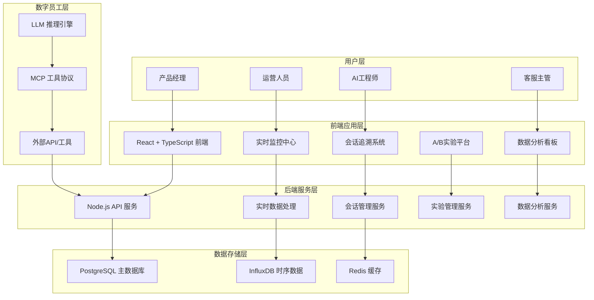
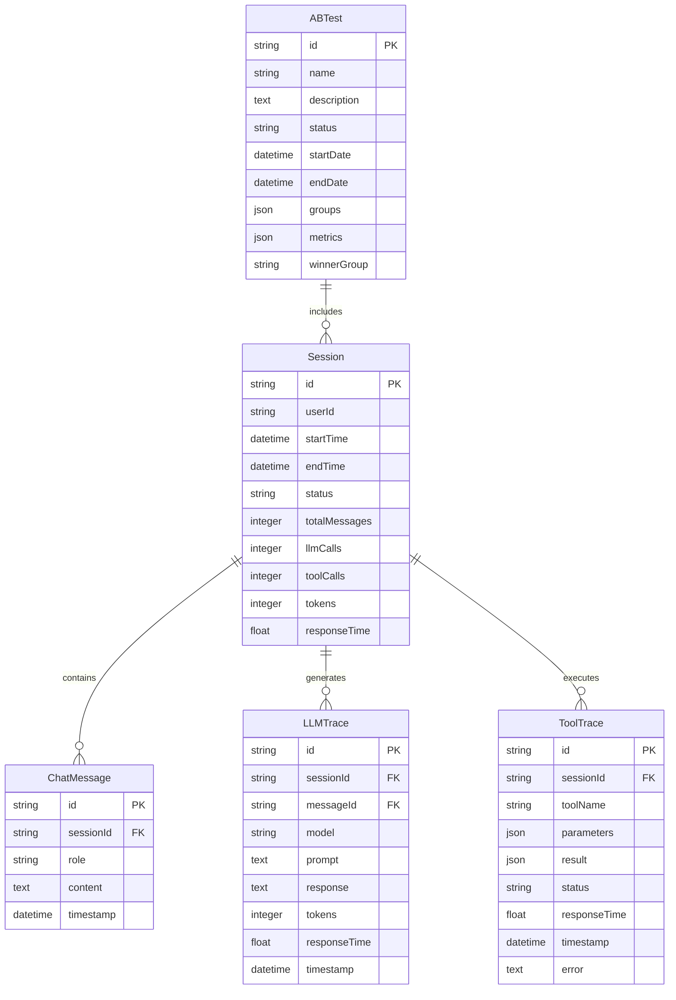

# KingSoft 数字员工智能管理平台 - 需求文档总览

## 📋 文档状态汇总

| 文档名称 | 状态 | 完成度 | 最后更新 | 说明 |
|---------|------|--------|----------|------|
| **产品需求文档 (PRD)** | ✅ 完整 | 100% | 2024-08-21 | 核心产品需求和功能详述 |
| **技术架构设计** | ✅ 完整 | 100% | 2024-08-21 | 系统架构和技术选型 |
| **API接口文档** | ✅ 完整 | 100% | 2024-08-21 | 完整的RESTful API规范 |
| **用户操作手册** | ✅ 完整 | 100% | 2024-08-21 | 用户使用指南和操作流程 |
| **部署指南** | ✅ 完整 | 100% | 2024-08-21 | 快速部署和环境配置 |
| **部署运维指南** | ✅ 完整 | 100% | 2024-08-21 | 详细部署和运维手册 |

## 🎯 产品核心定位

**KingSoft** 是一个专为数字员工(Digital Employee)设计的智能管理平台，基于 **LLM + MCP** 架构，为企业提供：

- 🔍 **实时监控** - 数字员工运行状态和性能指标
- 📊 **深度分析** - 会话追溯、推理过程可视化
- 🧪 **A/B实验** - 数据驱动的模型和策略优化
- 📈 **数据洞察** - 全方位的分析报表和趋势预测

## 🏗️ 系统架构概览

## 🎨 核心功能模块

### 1. 全局监控仪表盘 (Dashboard)
- **实时流量监控** - 在线用户数、RPM、实时健康状态
- **关键指标展示** - 会话成功率、响应时间、Token消耗
- **异常告警** - 自定义阈值的智能告警系统
- **服务状态地图** - 多业务线数字员工状态总览

### 2. 会话查询与追溯 (Sessions)
- **强大搜索能力** - 多维度搜索和高级筛选
- **完整对话还原** - 聊天气泡式会话展示
- **LLM推理可视化** - 提示词、推理过程、Token统计
- **MCP工具追溯** - 工具调用时间线和详细参数
- **Chain-of-Thought可视化** - 数字员工思维过程展示

### 3. A/B测试平台 (AB Testing)
- **实验生命周期管理** - 创建、配置、监控、分析
- **多变量测试** - 模型、提示词、工具链对比
- **统计显著性分析** - 科学的实验结果评估
- **流量分配管理** - 灵活的用户分组策略

### 4. 数据分析中心 (Analytics)
- **性能分析** - 响应时间、成功率趋势分析
- **成本分析** - Token消耗、模型调用成本统计
- **用户行为分析** - 交互模式和满意度分析
- **业务指标跟踪** - 自定义KPI监控和报表

## 🛠️ 技术栈详情

### 前端技术栈
- **框架**: React 18 + TypeScript
- **构建工具**: Vite + SWC
- **UI库**: Tailwind CSS + Headless UI
- **图标**: Lucide React
- **图表**: Recharts / Chart.js
- **状态管理**: Zustand / React Context

### 后端技术栈
- **运行时**: Node.js 18+ 
- **框架**: Express.js / Fastify
- **语言**: TypeScript
- **ORM**: Prisma / TypeORM
- **验证**: Zod / Joi
- **文档**: OpenAPI + Swagger

### 数据存储
- **主数据库**: PostgreSQL 14+
- **时序数据库**: InfluxDB 2.0
- **缓存**: Redis 7.0
- **消息队列**: BullMQ / Redis Streams

### 部署运维
- **容器化**: Docker + Docker Compose
- **编排**: Kubernetes (可选)
- **CI/CD**: GitHub Actions
- **监控**: Prometheus + Grafana
- **日志**: ELK Stack (Elasticsearch + Logstash + Kibana)

## 📊 数据模型设计

### 核心数据实体

## 🎯 用户角色与权限

| 角色 | 权限范围 | 主要功能 |
|------|----------|----------|
| **超级管理员** | 全部权限 | 系统管理、用户管理、全局配置 |
| **产品经理** | 查看+分析+实验 | 数据分析、A/B测试管理、产品决策 |
| **运营人员** | 查看+监控 | 实时监控、异常处理、用户反馈处理 |
| **AI工程师** | 查看+调试+实验 | 会话调试、提示词优化、模型调参 |
| **客服主管** | 查看+质检 | 对话质量检查、服务效果评估 |

## 🔄 开发里程碑

### Phase 1: MVP版本 (已完成)
- ✅ 核心架构搭建
- ✅ 基础监控面板
- ✅ 会话查询功能
- ✅ 简单A/B测试
- ✅ 基础数据分析

### Phase 2: 增强版本 (当前阶段)
- ✅ 实时监控升级
- ✅ 深度会话追溯
- ✅ Chain-of-Thought可视化
- ✅ 双维度聚合看板
- ✅ 高级查询过滤

### Phase 3: 智能化版本 (规划中)
- 🔄 智能告警系统
- 🔄 自动化报表
- 🔄 异常自动诊断
- 🔄 性能自动优化建议
- 🔄 知识库管理

### Phase 4: 企业版本 (未来)
- ⏳ 多租户支持
- ⏳ 细粒度权限控制
- ⏳ 企业级安全认证
- ⏳ 私有化部署支持
- ⏳ 开放API生态

## 📈 关键性能指标 (KPI)

### 技术指标
- **系统可用性**: > 99.9%
- **响应时间**: 
  - 仪表盘加载 < 2秒
  - 搜索响应 < 3秒
  - API响应 < 500ms
- **并发处理**: 支持1000+并发用户
- **数据吞吐**: 支持10万+会话/日

### 业务指标
- **问题解决效率**: 提升60%+
- **决策速度**: 提升50%+
- **数字员工性能**: 优化30%+
- **用户满意度**: > 90%

## 🔗 相关文档链接

1. **[产品需求文档 (PRD)](./产品需求文档-KingSoft数字员工管理平台.md)** - 详细功能需求和业务逻辑
2. **[技术架构设计](./技术架构设计.md)** - 系统架构和技术选型详述
3. **[API接口文档](./API接口文档.md)** - 完整的RESTful API规范
4. **[用户操作手册](./用户操作手册.md)** - 详细的用户使用指南
5. **[部署指南](./部署指南.md)** - 快速部署和环境配置
6. **[部署运维指南](./部署运维指南.md)** - 生产环境部署和运维

## 💡 设计理念

### 用户体验优先
- **直观易用** - 清晰的信息架构和交互设计
- **响应迅速** - 优化的性能和流畅的操作体验
- **个性化** - 可定制的面板和个人偏好设置

### 数据驱动决策
- **全面监控** - 覆盖数字员工全生命周期的数据采集
- **深度分析** - 多维度的数据挖掘和智能洞察
- **科学实验** - 严谨的A/B测试和统计分析

### 可扩展架构
- **模块化设计** - 松耦合的微服务架构
- **标准化接口** - 统一的API规范和数据格式
- **插件生态** - 支持第三方工具和服务集成

---

**文档维护**: 本文档由产品团队维护，定期更新，确保与实际系统保持同步。

**联系方式**: 
- 产品团队: product@kingsoft.ai
- 技术团队: engineering@kingsoft.ai
- 项目经理: pm@kingsoft.ai